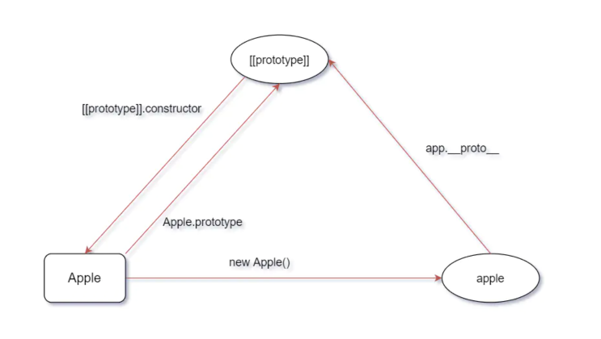
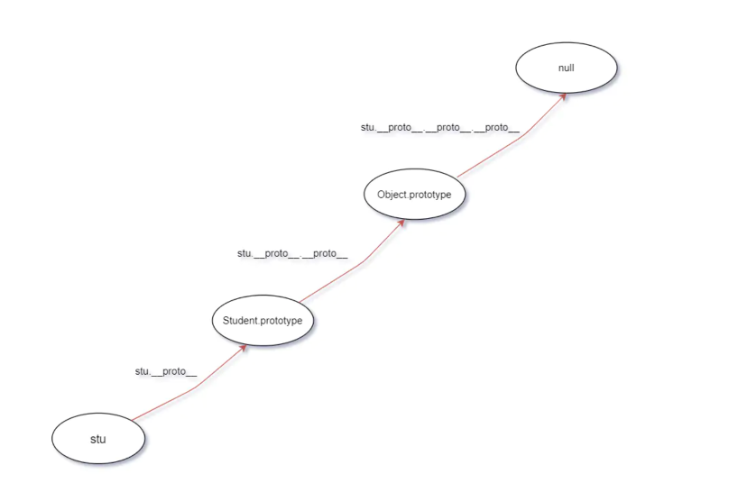
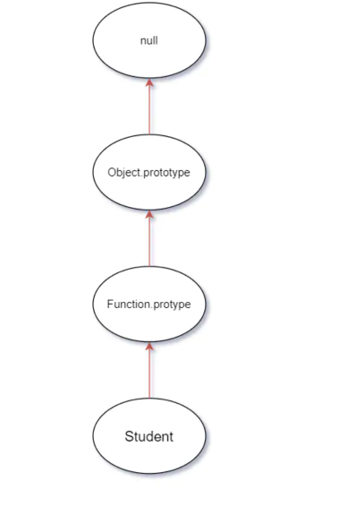

# 前端总结

## 1. 类型

### 1.1. 原始（Primitive）类型

在 JS 中，存在着 6 种原始值，分别是：  

- boolean  
- null  
- undefined  
- number  
- string  
- symbol  

首先原始类型存储的都是值，是没有函数可以调用的，比如 undefined.toString().  

'1'.toString() 是可以使用的。其实在这种情况下，'1' 已经不是原始类型了，而是被强制转换成了 String 类型也就是对象类型，所以可以调用 toString 函数。  

其中 JS 的 number 类型是浮点类型的，在使用中会遇到某些 Bug，比如 0.1 + 0.2 !== 0.3.  

另外对于 null 来说，很多人会认为他是个对象类型，其实这是错误的。虽然 typeof null 会输出 object，但是这只是 JS 存在的一个悠久 Bug。在 JS 的最初版本中使用的是 32 位系统，为了性能考虑使用低位存储变量的类型信息，000 开头代表是对象，然而 null 表示为全零，所以将它错误的判断为 object 。虽然现在的内部类型判断代码已经改变了，但是对于这个 Bug 却是一直流传下来。  

### 1.2. 对象（Object）类型

在 JS 中，除了原始类型那么其他的都是对象类型了。对象类型和原始类型不同的是，原始类型存储的是值，对象类型存储的是地址（指针）。  

当你创建了一个对象类型的时候，计算机会在内存中帮我们开辟一个空间来存放值，但是我们需要找到这个空间，这个空间会拥有一个地址（指针）。  

对于常量 a 来说，假设内存地址（指针）为 #001，那么在地址 #001 的位置存放了值 []，常量 a 存放了地址（指针） #001. 将变量赋值给另外一个变量时，复制的是原本变量的地址（指针），也就是说当前变量 b 存放的地址（指针）也是 #001，当我们进行数据修改的时候，就会修改存放在地址（指针） #001 上的值，也就导致了两个变量的值都发生了改变。  

```js
const a = [];
const b = a;
b.push(1);

console.log("a=", a, "b=", b); // a= [ 1 ] b= [ 1 ]
```

看函数参数是对象的情况  

```js
function test(person) {
  person.age = 26;
  person = {
    name: "yyy",
    age: 30,
  };

  return person;
}
const p1 = {
  name: "yck",
  age: 25,
};
const p2 = test(p1);
console.log(p1); // { name: 'yck', age: 26 }
console.log(p2); // { name: 'yyy', age: 30 }
```

person 拥有了一个新的地址（指针），也就和 p1 没有任何关系了，导致了最终两个变量的值是不相同的。  

### 1.3. typeof vs instanceof

typeof 对于原始类型来说，除了 null 都可以显示正确的类型

```js
typeof 1 // 'number'
typeof '1' // 'string'
typeof undefined // 'undefined'
typeof true // 'boolean'
typeof Symbol() // 'symbol'
```

typeof 对于对象来说，除了函数都会显示 object，所以说 typeof 并不能准确判断变量到底是什么类型  

```js
typeof [] // 'object'
typeof {} // 'object'
typeof console.log // 'function'
```

想判断一个对象的正确类型，这时候可以考虑使用 instanceof，因为内部机制是通过原型链来判断的  

```js
const Person = function () {};
const p1 = new Person();
p1 instanceof Person; // true

const str = "hello world";
str instanceof String; // false

const str1 = new String("hello world");
str1 instanceof String; // true
```

对于原始类型来说，你想直接通过 instanceof 来判断类型是不行的，当然我们还是有办法让 instanceof 判断原始类型的

Symbol.hasInstance 其实就是一个能让我们自定义 instanceof 行为的东西，以上代码等同于 typeof 'hello world' === 'string'，所以结果自然是 true 了。这其实也侧面反映了一个问题， instanceof 也不是百分之百可信的。

```js
class PrimitiveString {
  static [Symbol.hasInstance](x) {
    return typeof x === 'string'
  }
}
console.log('hello world' instanceof PrimitiveString) // true
```

### 1.4. 类型转换

在 JS 中类型转换只有三种情况，分别是：

- 转换为布尔值
- 转换为数字
- 转换为字符串  


#### 转Boolean

在条件判断时，除了 undefined， null， false， NaN， ''， 0， -0，其他所有值都转为 true，包括所有对象。  

#### 对象转原始类型

对象在转换类型的时候，会调用内置的 [[ToPrimitive]] 函数，对于该函数来说，算法逻辑一般来说如下：  

- 如果已经是原始类型了，那就不需要转换了
- 如果需要转字符串类型就调用 x.toString()，转换为基础类型的话就返回转换的值。不是字符串类型的话就先调用 valueOf，结果不是基础类型的话再调用 toString
- 调用 x.valueOf()，如果转换为基础类型，就返回转换的值
- 如果都没有返回原始类型，就会报错

可以重写 Symbol.toPrimitive ，该方法在转原始类型时调用优先级最高。

```js
let a = {
  valueOf() {
    return 0
  },
  toString() {
    return '1'
  },
  [Symbol.toPrimitive]() {
    return 2
  }
}
1 + a // => 3
```

### 1.5. 四则运算符

- 运算中其中一方为字符串，那么就会把另一方也转换为字符串
- 如果一方不是字符串或者数字，那么会将它转换为数字或者字符串  

```js
1 + '1' // '11'          将数字 1 转换为字符串，得到结果 '11'
true + true // 2         将 true 转为数字 1
4 + [1,2,3] // "41,2,3"  将数组通过 toString 转为字符串 1,2,3，得到结果 41,2,3
```

加法还需要注意这个表达式 'a' + + 'b'

```js
'a' + + 'b' // -> "aNaN"
```

因为 + 'b' 等于 NaN，所以结果为 "aNaN"，你可能也会在一些代码中看到过 + '1' 的形式来快速获取 number 类型。  

### 1.6. 比较运算符

1. 如果是对象，就通过 toPrimitive 转换对象
2. 如果是字符串，就通过 unicode 字符索引来比较  

```js
[2, 1] > [2, 0]  // true
```

## 2. this

如何正确判断 this？箭头函数的 this 是什么？  

```js
function foo() {
  console.log(this.a);
}
var a = 1;
foo();

const obj = {
  a: 2,
  foo: foo,
};
obj.foo();

const c = new foo();
```

- 对于直接调用 foo 来说，不管 foo 函数被放在了什么地方，this 一定是 window
- 对于 obj.foo() 来说，我们只需要记住，谁调用了函数，谁就是 this，所以在这个场景下 foo 函数中的 this 就是 obj 对象
- 对于 new 的方式来说，this 被永远绑定在了 c 上面，不会被任何方式改变 this  

箭头函数中的 this  

```js
function a() {
  return () => {
    return () => {
      console.log(this === global); // true(node 环境global)
    };
  };
}
console.log(a()()());
```

箭头函数其实是没有 this 的，箭头函数中的 this 只取决包裹箭头函数的第一个普通函数的 this。在这个例子中，因为包裹箭头函数的第一个普通函数是 a，所以此时的 this 是 window。另外对箭头函数使用 bind 这类函数是无效的。  

### bind

对于这些函数来说，this 取决于第一个参数，如果第一个参数为空，那么就是 window。  

如果对一个函数进行多次 bind，那么上下文会是什么呢？  

```js
let a = {};
let fn = function () {
  console.log(this);
};
fn.bind().bind(a)(); // => window
```

可以把上述代码转换成另一种形式

```js
// fn.bind().bind(a) 等于
let fn2 = function fn1() {
  return function() {
    return fn.apply()
  }.apply(a)
}
fn2()
```

不管我们给函数 bind 几次，fn 中的 this 永远由第一次 bind 决定，所以结果永远是 window。  


## 3. == vs ===

对于 == 来说，如果对比双方的类型不一样的话，就会进行类型转换  


## 4. 闭包

闭包的定义：函数 A 内部有一个函数 B，函数 B 可以访问到函数 A 中的变量，那么函数 B 就是闭包。

```js
function A() {
  let a = 1;
  window.B = function () {
    console.log(a);
  };
}
A();
B(); // 1
```

在 JS 中，闭包存在的意义就是让我们可以间接访问函数内部的变量。  

```js
for (var i = 1; i <= 5; i++) {
  setTimeout(function timer() {
    console.log(i)
  }, i * 1000)
}
```

setTimeout 是个异步函数，所以会先把循环全部执行完毕，这时候 i 就是 6 了，所以会输出一堆 6。  

解决办法有三种，第一种是使用闭包的方式  

```js
for (var i = 1; i <= 5; i++) {
  (function (j) {
    setTimeout(function timer() {
      console.log(j);
    }, j * 1000);
  })(i);
}
```

首先使用了立即执行函数将 i 传入函数内部，这个时候值就被固定在了参数 j 上面不会改变，当下次执行 timer 这个闭包的时候，就可以使用外部函数的变量 j，从而达到目的。  

第二种就是使用 setTimeout 的第三个参数，这个参数会被当成 timer 函数的参数传入。  

```js
for (var i = 1; i <= 5; i++) {
  setTimeout(
    function timer(j) {
      console.log(j)
    },
    i * 1000,
    i
  )
}
```

第三种就是使用 let 定义 i 来解决问题了

```js
for (let i = 1; i <= 5; i++) {
  setTimeout(function timer() {
    console.log(i)
  }, i * 1000)
}
```

由于 let i = xxx 为块级别作用域，因而这一情况下的循环展开结果为：

```js
{
    let i = 1;
    setTimeout( timer, 1 * 1000 );
}
{
    let i = 2;
    setTimeout( timer, 2 * 1000 );
}
{
    let i = 3;
    setTimeout( timer, 3 * 1000 );
}
```

## 5. JavaScript 原型

参考[资料](https://juejin.cn/post/6844904053651030030)  demo路径：demos/5-prototype  

### 5.1. __proto__  constructor prototype

#### 5.1.1. __proto__

任何一个对象都有原型，可以通过非标准属性 __proto__ 来访问一个对象的原型：  

```js
// 纯对象的原型默认是个空对象
console.log({}.__proto__); // => {}
```

```js
function Student(name, grade) {
  this.name = name;
  this.grade = grade;
}

const stu = new Student("xiaoMing", 6);
// Student 类型实例的原型，默认也是一个空对象
console.log(stu.__proto__); // => Student {}
```

__proto__ 是非标准属性，要访问一个对象的原型，建议使用 ES6 新增的 Reflect.getPrototypeOf 或者 Object.getPrototypeOf() 方法。

```js
{}.__proto__ === Object.getPrototypeOf({}); // => true
```

可以通过对 __proto__ 属性直接赋值的方式修改对象的原型，更推荐的做法是使用使用 ES6 的 Reflect.setPrototypeOf 或 Object.setPrototypeOf。不论哪一种方式，被设置的值的类型只能是对象或者 null，其它类型不起作用：  

```js
const obj = { name: 'xiaoMing' };
// 原型为空对象
console.log(obj.__proto__); // => {}

obj.__proto__ = 666;
// 非对象和 null 不生效
console.log(obj.__proto__); // => {}

// 设置原型为对象
obj.__proto__ = { a: 1 };
console.log(obj.__proto__); // => { a: 1 }
console.log(Reflect.getPrototypeOf(obj)); // => { a: 1 }
```

如果一个对象的 __proto__ 属性被赋值为 null，这个时候它的原型确实已经被修改为 null 了，但是你想再通过对 __proto__ 赋值的方式设置原型时是无效的，这个时候 __proto__ 和一个普通属性没有区别，只能通过 Reflect.setPrototypeOf 或 Object.setPrototypeOf 才能修改原型。原型是对象内部的一个属性 [[prototype]]，而 Reflect.setPrototypeOf 之所以能修改原型是因为它是直接修改对象的原型属性，也就是内部直接对对象的 [[prototype]] 属性赋值，而不会通过 __proto__ 的 getter。  

```js
const obj = { name: 'xiaoming' };

obj.__proto__ = null;
// ! 为什么不是 null
console.log(obj.__proto__); // => undefined
// 说明确实将原型设置为 null 了
console.log(Reflect.getPrototypeOf(obj)); // => null

// 再次赋值为 null
obj.__proto__ = null;
// 黑人问号？？？咋不是之前的 undefined 呢？
console.log(obj.__proto__); // => null

obj.__proto__ = { a: 1 };
console.log(obj.__proto__); // => { a: 1 }   __proto__ 就像一个普通属性一样 obj.xxx = { a: 1 }
// 并没有将原型设置成功
console.log(Reflect.getPrototypeOf(obj)); // => null

Reflect.setPrototypeOf(obj, { b: 2 });
// __proto__ 被设置为 null 后，obj 的 __proto__ 属性和一个普通的属性没有区别
console.log(obj.__proto__); // => { a: 1 }
// 使用 Reflect.setPrototypeOf 是可以设置原型的
console.log(Reflect.getPrototypeOf(obj)); // => { b: 2 }
```

__proto__ 是个定义在 Object.prototype 上的访问器属性, 也就是使用getter 和 setter 定义的属性，通过 __proto__ 的 getter 我们可以获取到对象的[[Prototype]]，也就是原型。  

#### 5.1.2. constructor和prototype

在 JavaScript 中，函数都可以用作构造器。构造器我们也可以称之为类.任何构造器都有一个 prototype 属性，默认是一个空的纯对象，所有由构造器构造的实例的原型都是指向它。  

构造器的 prototype 属性默认是个空对象，注意这里说的空对象指的是该对象没有可遍历属性.  

构造器的 prototype 有一个 constructor 属性，指向构造器本身.  

```js
function Apple() {}
const apple = new Apple();
console.log(apple instanceof Apple); // => true

const apple1 = new Apple();
const apple2 = new Apple();
// 实例的原型即 apple1.__proto__
console.log(apple1.__proto__ === Apple.prototype); // => true
console.log(apple2.__proto__ === Apple.prototype); // => true
console.log(Apple.prototype); // => Apple {}
console.log(Object.keys(Apple.prototype)); // => []
console.log(Apple.prototype.__proto__ === {}.__proto__); // true
console.log(Apple.prototype.constructor === Apple); // => true
```  

constructor 属性是不可遍历的，可以理解为内部是这样定义该属性的：

```js
Object.defineProperty(Apple.prototype, 'constructor', {
  value: Student,
  writable: true,
  // 不可枚举，无法通过 Object.keys() 获取到
  enumerable: fasle,
});
```

__proto__ ，prototype，constructor，Apple函数，实例 apple 和原型对象 [[prototype]] 之间的关系：  



__proto__ 存在于所有的对象上，prototype 存在于所有的函数上，他俩的关系就是：函数的 prototype 是所有使用 new 这个函数构造的实例的 __proto__。函数也是对象，所以函数同时有 __proto__ 和prototype。  

### 5.2. 原型链

各个原型之间构成的链，称之为原型链。  

```js
function Student(name, grade) {
  this.name = name;
  this.grade = grade;
}

const stu = new Student();
console.log(stu.notExists); // => undefined
console.log(stu.__proto__.__proto__ === {}.__proto__); // => true
```

访问 stu.notExists 的整个过程是：

1. 先看 stu 上是否存在 notExists，不存在，所以看 stu.__proto__
2. stu.__proto__ 上也不存在 notExists 属性，再看 stu.__proto__.__proto__，其实就是纯对象的原型：Object.prototype
3. 纯对象的原型上也不存在 notExists 属性，再往上，到 stu.__proto__.__proto__.__proto__ 上去找，其实就是 null
4. null 不存在 notExists 属性，返回 undefined



函数 Student 的原型链  



### 5.3. ES6 class 和构造器的关系

#### 5.3.1. ES6 class

ES6 class 就是构造器的语法糖。 babel 将 ES6 class 编译成了啥：

在线[babel](https://babeljs.io/repl#?browsers=defaults%2C%20not%20ie%2011%2C%20not%20ie_mob%2011&build=&builtIns=false&spec=false&loose=false&code_lz=MYGwhgzhAEDCCWAnUBTaBvAUNawD2AdhAC6ICuwxeiAFAB4A00Ank4gJQbY7TEAW8CADo60ALzQ6Abm45-goc3EsZPXgOGJliVdAC-mbgBNEYAO41OWNfiJ4QKISDwBzGgANA3K6AqOUAK6oHALQC45aBoAEnR5YTo9JnDIxT12QBh_wCllQBD9YLiNIUQ9aEAQt0AwdXd2XQMDIA&debug=false&forceAllTransforms=false&shippedProposals=false&circleciRepo=&evaluate=false&fileSize=false&timeTravel=false&sourceType=module&lineWrap=true&presets=env%2Ces2015-loose&prettier=false&targets=&version=7.12.12&externalPlugins=), presets选择es2005-loose  

原代码：

```js
class Circle {
  constructor(x, y, r) {
    this.x = x;
    this.y = y;
    this.r = r;
  }

  draw() {
    console.log(`画个坐标为 (${this.x}, ${this.y})，半径为 ${this.r} 的圆`);
  }
}
```

编译结果

```js
"use strict";
var Circle = /*#__PURE__*/function () {
  function Circle(x, y, r) {
    this.x = x;
    this.y = y;
    this.r = r;
  }

  var _proto = Circle.prototype;

  _proto.draw = function draw() {
    console.log("\u753B\u4E2A\u5750\u6807\u4E3A (" + this.x + ", " + this.y + ")\uFF0C\u534A\u5F84\u4E3A " + this.r + " \u7684\u5706");
  };

  return Circle;
}();
```

从上可以看出，ES6 的 class 就是构造器，class 上的方法定义在构造器的 prototype 上。  

#### 5.3.2. extends 继承

原代码:

```js
class Shape {
  constructor(x, y) {
    this.x = x;
    this.y = y;
  }
}

class Circle extends Shape {
  constructor(x, y, r) {
    super(x, y);
    this.r = r;
  }

  draw() {
    console.log(`画个坐标为 (${this.x}, ${this.y})，半径为 ${this.r} 的圆`);
  }
}
```

编译后

```js
"use strict";

function _inheritsLoose(subClass, superClass) {
  subClass.prototype = Object.create(superClass.prototype);
  subClass.prototype.constructor = subClass;
  // 让子类可以访问父类上的静态属性，其实就是定义在构造器自身上的属性
  subClass.__proto__ = superClass;
}

var Shape = function Shape(x, y) {
  this.x = x;
  this.y = y;
};

var Circle = /*#__PURE__*/ (function (_Shape) {
  _inheritsLoose(Circle, _Shape);

  function Circle(x, y, r) {
    var _this;
    // 组合继承: 子类构造器中调用了父类构造器并将 this 指向子类实例达到将父类的实例属性组合到子类实例上
    _this = _Shape.call(this, x, y) || this;
    _this.r = r;
    return _this;
  }

  var _proto = Circle.prototype;

  _proto.draw = function draw() {
    console.log(
      "\u753B\u4E2A\u5750\u6807\u4E3A (" +
        this.x +
        ", " +
        this.y +
        ")\uFF0C\u534A\u5F84\u4E3A " +
        this.r +
        " \u7684\u5706"
    );
  };

  return Circle;
})(Shape);
```

ES6 的 extends 实现的是原型继承 + 组合继承。  

### 5.4. 原型继承

对于类 A 和类 B，如果满足 A.prototype.__proto__ === B.prototype，那么 A 原型继承 B  

```js
function A() {}
function B() {
  this.b = "污染 A 的原型";
}

A.prototype = new B();
console.log(A.prototype.__proto__ === B.prototype); // => true
const a = new A();
const b = new B();
console.log(a instanceof A); // => true
console.log(a instanceof B); // => true
console.log(b instanceof B); // => true
console.log(A.prototype.constructor); // => [Function: B]
```

这种方式会导致 B 的实例属性污染 A 的原型。解决办法就是通过一个空的函数桥接一下，空的函数总不会有实例属性污染原型链  

```js
function A(p) {
  this.p = p;
}

function B() {
  this.b = "污染原型";
}

// 空函数
function Empty() {}

Empty.prototype = B.prototype;
A.prototype = new Empty();
// 修正 constructor 指向
A.prototype.constructor = A;

// 满足原型继承的定义
console.log(A.prototype.__proto__ === B.prototype); // => true

const a = new A("p");
console.log(a instanceof A); // => true

const b = new B();
console.log(b instanceof B); // => true

// a 也是 B 的实例
console.log(a instanceof B); // => true
console.log(a.__proto__.__proto__ === B.prototype); // => true
console.log(A.prototype.constructor); // => [Function: A]
```

### 5.5. 和原型相关语法特性

#### 5.5.1. new 运算符原理

```js
function isObject(value) {
  const type = typeof value;
  return value !== null && (type === "object" || type === "function");
}

/**
 * constructor 表示 new 的构造器
 * args 表示传给构造器的参数
 */
function New(constructor, ...args) {
  // new 的对象不是函数就抛 TypeError
  if (typeof constructor !== "function")
    throw new TypeError(`${constructor} is not a constructor`);

  // 创建一个原型为构造器的 prototype 的空对象 target
  const target = Object.create(constructor.prototype);
  // 将构造器的 this 指向上一步创建的空对象，并执行，为了给 this 添加实例属性
  const result = constructor.apply(target, args);

  // 上一步的返回如果是对象就直接返回，否则返回 target
  return isObject(result) ? result : target;
}

// 测试New
function Computer(brand) {
  this.brand = brand;
}

const c = New(Computer, "Apple");
console.log(c); // => Computer { brand: 'Apple' }
```

#### 5.5.2. instanceof 运算符原理

instanceof 用于判断对象是否是某个类的实例，obj instanceof 构造器 A，等同于判断 A 的 prototype 是不是 obj 的原型（也可能是二级原型）。

```js
function instanceOf(obj, constructor) {
  if (!isObject(constructor)) {
    throw new TypeError(`Right-hand side of 'instanceof' is not an object`);
  } else if (typeof constructor !== "function") {
    throw new TypeError(`Right-hand side of 'instanceof' is not callable`);
  }

  // isPrototypeOf() 方法用于测试一个对象是否存在于另一个对象的原型链上。
  return constructor.prototype.isPrototypeOf(obj);
}
```

### 5.6. 原型污染

[Lodash库爆出严重安全漏洞，波及400万+项目](https://mp.weixin.qq.com/s/tfZq2PZylGfMjOp8h8eeTw)  
[最新：Lodash 严重安全漏洞背后你不得不知道的 JavaScript 知识](https://juejin.cn/post/6844903887686598663)  

原型污染指的是：攻击者通过某种手段修改 JavaScript 对象的原型.  

#### 5.6.1. 性能问题

原型被污染会增加遍历的次数，每次访问对象自身不存在的属性时也要访问下原型上被污染的属性。

```js
// 原型被污染会增加遍历的次数，每次访问对象自身不存在的属性时也要访问下原型上被污染的属性。
Object.prototype.hack = "污染原型的属性";
const obj = { name: "xiaoHong", age: 18 };
for (const key in obj) {
  console.log('key=', key); // key= name / key= age / key= hack
  if (obj.hasOwnProperty(key)) {
    console.log(obj[key]); // xiaoHong / 18
  }
}
```

#### 5.6.2. 导致意外的逻辑 bug

```js
// node 安全漏洞案例
const express = require("express");
const bodyParser = require("body-parser");
const cookieParser = require("cookie-parser");
const path = require("path");

const isObject = (obj) => obj && obj.constructor && obj.constructor === Object;

function merge(a, b) {
  for (var attr in b) {
    if (isObject(a[attr]) && isObject(b[attr])) {
      merge(a[attr], b[attr]);
    } else {
      a[attr] = b[attr];
    }
  }
  return a;
}

function clone(a) {
  return merge({}, a);
}

// Constants
const PORT = 8080;
const HOST = "127.0.0.1";
const admin = {};

// App
const app = express();
app.use(bodyParser.json());
app.use(cookieParser());

app.use("/", express.static(path.join(__dirname, "views")));
app.post("/signup", (req, res) => {
  var body = JSON.parse(JSON.stringify(req.body));
  var copybody = clone(body);
  if (copybody.name) {
    res.cookie("name", copybody.name).json({
      done: "cookie set",
    });
  } else {
    res.json({
      error: "cookie not set",
    });
  }
});
app.get("/getFlag", (req, res) => {
  var аdmin = JSON.parse(JSON.stringify(req.cookies));
  if (admin.аdmin == 1) {
    res.send("hackim19{}");
  } else {
    res.send("You are not authorized");
  }
});
app.listen(PORT, HOST);
console.log(`Running on http://${HOST}:${PORT}`);

// 漏洞就在于 merge 函数上，我们可以这样攻击：
// curl -vv --header 'Content-type: application/json' -d '{"__proto__": {"admin": 1}}' 'http://127.0.0.1:4000/signup';
// curl -vv 'http://127.0.0.1/getFlag'
```

首先请求 /signup 接口，在 NodeJS 服务中，我们调用了有漏洞的 merge 方法，并通过 __proto__ 为 Object.prototype（因为 {}.__proto__ === Object.prototype） 添加上一个新的属性 admin，且值为 1。  
再次请求 getFlag 接口，访问了 Object 原型上的admin，条件语句 admin.аdmin == 1 为 true，服务被攻击。  

#### 5.6.3. 预防原型污染

其实原型污染大多发生在调用会修改或者扩展对象属性的函数时，例如 lodash 的 defaults，jquery 的 extend。预防原型污染最主要还是要有防患意识，养成良好的编码习惯。  

##### Object.create(null)

通过 Object.create(null) 创建没有原型的对象，即便你对它设置__proto__ 也没有用，因为它的原型一开始就是 null，没有 __proro__ 的 setter。

```js
const obj = Object.create(null);
obj.__proto__ = { hack: '污染原型的属性' };
const obj1 = {};
console.log(obj1.__proto__); // => {}
```

##### Object.freeze(obj)

Object.freeze(obj) 冻结对象 obj，被冻结的对象不能被修改属性，成为不可扩展对象。  

```js
const obj = Object.freeze({ name: 'xiaoHong' });
obj.xxx = 666;
console.log(obj); // => { name: 'xiaoHong' }
console.log(Object.isExtensible(obj)); // => false
obj.__proto__ = null; // => TypeError: #<Object> is not extensible
```

面试题：

```js
function Page() {
  return this.hosts;
}
Page.hosts = ["h1"];
Page.prototype.hosts = ["h2"];

const p1 = new Page();
const p2 = Page();

//  new 的时候如果 return 了对象，会直接拿这个对象作为 new 的结果，因此，p1 应该是 this.hosts 的结果，而在 new Page() 的时候，this 是一个以 Page.prototype 为原型的 target 对象，所以这里 this.hosts 可以访问到 Page.prototype.hosts 也就是 ['h2']。这样 p1 就是等于 ['h2']，['h2'] 没有 hosts 属性所以返回 undefined。
console.log(p1.hosts); // => undefiend

// p2 是直接调用 Page 构造函数的结果，直接调用 page 函数，这个时候 this 指向全局对象，全局对象并没 hosts 属性，因此返回 undefined，往 undefined 上访问 hosts 当然报错。
console.log(p2.hosts); // => cannot read property 'hosts' of undefined
```

## 6. 手写promise

## 7. 手写 call、apply 及 bind 函数

### 7.1. call

### 7.2. apply

### 7.3. bind

## 8. 垃圾回收机制

### 8.1. 新生代算法

### 8.2. 老生代算法


