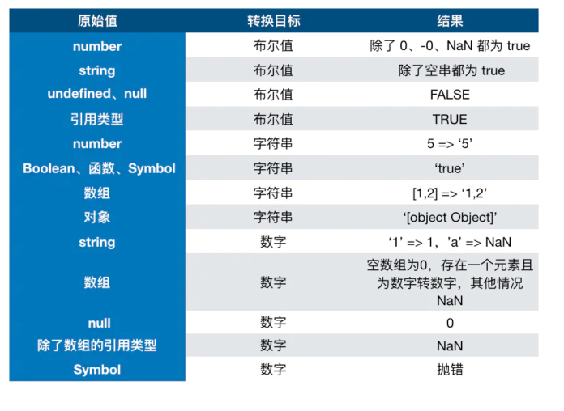
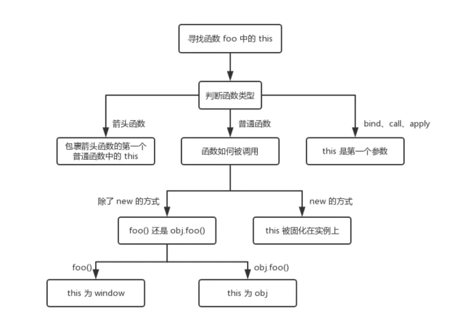
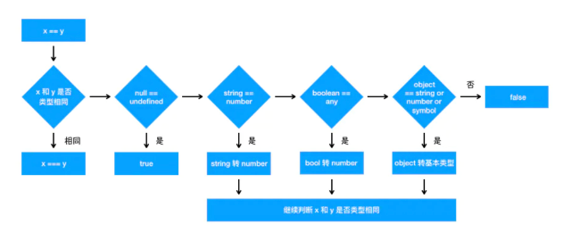

# 前端总结

## 1. 类型

### 1.1. 原始（Primitive）类型

在 JS 中，存在着 6 种原始值，分别是：  

- boolean  
- null  
- undefined  
- number  
- string  
- symbol  

首先原始类型存储的都是值，是没有函数可以调用的，比如 undefined.toString().  

'1'.toString() 是可以使用的。其实在这种情况下，'1' 已经不是原始类型了，而是被强制转换成了 String 类型也就是对象类型，所以可以调用 toString 函数。  

其中 JS 的 number 类型是浮点类型的，在使用中会遇到某些 Bug，比如 0.1 + 0.2 !== 0.3.  

另外对于 null 来说，很多人会认为他是个对象类型，其实这是错误的。虽然 typeof null 会输出 object，但是这只是 JS 存在的一个悠久 Bug。在 JS 的最初版本中使用的是 32 位系统，为了性能考虑使用低位存储变量的类型信息，000 开头代表是对象，然而 null 表示为全零，所以将它错误的判断为 object 。虽然现在的内部类型判断代码已经改变了，但是对于这个 Bug 却是一直流传下来。  

### 1.2. 对象（Object）类型

在 JS 中，除了原始类型那么其他的都是对象类型了。对象类型和原始类型不同的是，原始类型存储的是值，对象类型存储的是地址（指针）。  

当你创建了一个对象类型的时候，计算机会在内存中帮我们开辟一个空间来存放值，但是我们需要找到这个空间，这个空间会拥有一个地址（指针）。  

对于常量 a 来说，假设内存地址（指针）为 #001，那么在地址 #001 的位置存放了值 []，常量 a 存放了地址（指针） #001. 将变量赋值给另外一个变量时，复制的是原本变量的地址（指针），也就是说当前变量 b 存放的地址（指针）也是 #001，当我们进行数据修改的时候，就会修改存放在地址（指针） #001 上的值，也就导致了两个变量的值都发生了改变。  

```js
const a = [];
const b = a;
b.push(1);

console.log("a=", a, "b=", b); // a= [ 1 ] b= [ 1 ]
```

看函数参数是对象的情况  

```js
function test(person) {
  person.age = 26;
  person = {
    name: "yyy",
    age: 30,
  };

  return person;
}
const p1 = {
  name: "yck",
  age: 25,
};
const p2 = test(p1);
console.log(p1); // { name: 'yck', age: 26 }
console.log(p2); // { name: 'yyy', age: 30 }
```

person 拥有了一个新的地址（指针），也就和 p1 没有任何关系了，导致了最终两个变量的值是不相同的。  

### 1.3. typeof vs instanceof

typeof 对于原始类型来说，除了 null 都可以显示正确的类型

```js
typeof 1 // 'number'
typeof '1' // 'string'
typeof undefined // 'undefined'
typeof true // 'boolean'
typeof Symbol() // 'symbol'
```

typeof 对于对象来说，除了函数都会显示 object，所以说 typeof 并不能准确判断变量到底是什么类型  

```js
typeof [] // 'object'
typeof {} // 'object'
typeof console.log // 'function'
```

想判断一个对象的正确类型，这时候可以考虑使用 instanceof，因为内部机制是通过原型链来判断的  

```js
const Person = function () {};
const p1 = new Person();
p1 instanceof Person; // true

const str = "hello world";
str instanceof String; // false

const str1 = new String("hello world");
str1 instanceof String; // true
```

对于原始类型来说，你想直接通过 instanceof 来判断类型是不行的，当然我们还是有办法让 instanceof 判断原始类型的

Symbol.hasInstance 其实就是一个能让我们自定义 instanceof 行为的东西，以上代码等同于 typeof 'hello world' === 'string'，所以结果自然是 true 了。这其实也侧面反映了一个问题， instanceof 也不是百分之百可信的。

```js
class PrimitiveString {
  static [Symbol.hasInstance](x) {
    return typeof x === 'string'
  }
}
console.log('hello world' instanceof PrimitiveString) // true
```

### 1.4. 类型转换

在 JS 中类型转换只有三种情况，分别是：

- 转换为布尔值
- 转换为数字
- 转换为字符串  



#### 转Boolean

在条件判断时，除了 undefined， null， false， NaN， ''， 0， -0，其他所有值都转为 true，包括所有对象。  

#### 对象转原始类型

对象在转换类型的时候，会调用内置的 [[ToPrimitive]] 函数，对于该函数来说，算法逻辑一般来说如下：  

- 如果已经是原始类型了，那就不需要转换了
- 如果需要转字符串类型就调用 x.toString()，转换为基础类型的话就返回转换的值。不是字符串类型的话就先调用 valueOf，结果不是基础类型的话再调用 toString
- 调用 x.valueOf()，如果转换为基础类型，就返回转换的值
- 如果都没有返回原始类型，就会报错

可以重写 Symbol.toPrimitive ，该方法在转原始类型时调用优先级最高。

```js
let a = {
  valueOf() {
    return 0
  },
  toString() {
    return '1'
  },
  [Symbol.toPrimitive]() {
    return 2
  }
}
1 + a // => 3
```

### 1.5. 四则运算符

- 运算中其中一方为字符串，那么就会把另一方也转换为字符串
- 如果一方不是字符串或者数字，那么会将它转换为数字或者字符串  

```js
1 + '1' // '11'          将数字 1 转换为字符串，得到结果 '11'
true + true // 2         将 true 转为数字 1
4 + [1,2,3] // "41,2,3"  将数组通过 toString 转为字符串 1,2,3，得到结果 41,2,3
```

加法还需要注意这个表达式 'a' + + 'b'

```js
'a' + + 'b' // -> "aNaN"
```

因为 + 'b' 等于 NaN，所以结果为 "aNaN"，你可能也会在一些代码中看到过 + '1' 的形式来快速获取 number 类型。  

### 1.6. 比较运算符

1. 如果是对象，就通过 toPrimitive 转换对象
2. 如果是字符串，就通过 unicode 字符索引来比较  

```js
[2, 1] > [2, 0]  // true
```

## 2. this

如何正确判断 this？箭头函数的 this 是什么？  

```js
function foo() {
  console.log(this.a);
}
var a = 1;
foo();

const obj = {
  a: 2,
  foo: foo,
};
obj.foo();

const c = new foo();
```

- 对于直接调用 foo 来说，不管 foo 函数被放在了什么地方，this 一定是 window
- 对于 obj.foo() 来说，我们只需要记住，谁调用了函数，谁就是 this，所以在这个场景下 foo 函数中的 this 就是 obj 对象
- 对于 new 的方式来说，this 被永远绑定在了 c 上面，不会被任何方式改变 this  

箭头函数中的 this  

```js
function a() {
  return () => {
    return () => {
      console.log(this === global); // true(node 环境global)
    };
  };
}
console.log(a()()());
```

箭头函数其实是没有 this 的，箭头函数中的 this 只取决包裹箭头函数的第一个普通函数的 this。在这个例子中，因为包裹箭头函数的第一个普通函数是 a，所以此时的 this 是 window。另外对箭头函数使用 bind 这类函数是无效的。  

### bind

对于这些函数来说，this 取决于第一个参数，如果第一个参数为空，那么就是 window。  

如果对一个函数进行多次 bind，那么上下文会是什么呢？  

```js
let a = {};
let fn = function () {
  console.log(this);
};
fn.bind().bind(a)(); // => window
```

可以把上述代码转换成另一种形式

```js
// fn.bind().bind(a) 等于
let fn2 = function fn1() {
  return function() {
    return fn.apply()
  }.apply(a)
}
fn2()
```

不管我们给函数 bind 几次，fn 中的 this 永远由第一次 bind 决定，所以结果永远是 window。  



## 3. == vs ===

对于 == 来说，如果对比双方的类型不一样的话，就会进行类型转换  



## 4. 闭包

闭包的定义：函数 A 内部有一个函数 B，函数 B 可以访问到函数 A 中的变量，那么函数 B 就是闭包。

```js
function A() {
  let a = 1;
  window.B = function () {
    console.log(a);
  };
}
A();
B(); // 1
```

在 JS 中，闭包存在的意义就是让我们可以间接访问函数内部的变量。  

```js
for (var i = 1; i <= 5; i++) {
  setTimeout(function timer() {
    console.log(i)
  }, i * 1000)
}
```

setTimeout 是个异步函数，所以会先把循环全部执行完毕，这时候 i 就是 6 了，所以会输出一堆 6。  

解决办法有三种，第一种是使用闭包的方式  

```js
for (var i = 1; i <= 5; i++) {
  (function (j) {
    setTimeout(function timer() {
      console.log(j);
    }, j * 1000);
  })(i);
}
```

首先使用了立即执行函数将 i 传入函数内部，这个时候值就被固定在了参数 j 上面不会改变，当下次执行 timer 这个闭包的时候，就可以使用外部函数的变量 j，从而达到目的。  


