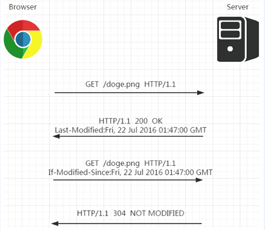

# 前端总结

- [前端总结](#前端总结)
  - [1. 类型](#1-类型)
    - [1.1. 原始（Primitive）类型](#11-原始primitive类型)
    - [1.2. 对象（Object）类型](#12-对象object类型)
    - [1.3. typeof vs instanceof](#13-typeof-vs-instanceof)
    - [1.4. 类型转换](#14-类型转换)
      - [转Boolean](#转boolean)
      - [对象转原始类型](#对象转原始类型)
    - [1.5. 四则运算符](#15-四则运算符)
    - [1.6. 比较运算符](#16-比较运算符)
  - [2. this](#2-this)
    - [bind](#bind)
  - [3. == vs ===](#3--vs-)
  - [4. 闭包](#4-闭包)
  - [5. JavaScript 原型](#5-javascript-原型)
    - [5.1. __proto__  constructor prototype](#51-proto--constructor-prototype)
      - [5.1.1. __proto__](#511-proto)
      - [5.1.2. constructor和prototype](#512-constructor和prototype)
    - [5.2. 原型链](#52-原型链)
    - [5.3. ES6 class 和构造器的关系](#53-es6-class-和构造器的关系)
      - [5.3.1. ES6 class](#531-es6-class)
      - [5.3.2. extends 继承](#532-extends-继承)
    - [5.4. 原型继承](#54-原型继承)
    - [5.5. 和原型相关语法特性](#55-和原型相关语法特性)
      - [5.5.1. new 运算符原理](#551-new-运算符原理)
      - [5.5.2. instanceof 运算符原理](#552-instanceof-运算符原理)
    - [5.6. 原型污染](#56-原型污染)
      - [5.6.1. 性能问题](#561-性能问题)
      - [5.6.2. 导致意外的逻辑 bug](#562-导致意外的逻辑-bug)
      - [5.6.3. 预防原型污染](#563-预防原型污染)
        - [Object.create(null)](#objectcreatenull)
        - [Object.freeze(obj)](#objectfreezeobj)
  - [6. 手写promise](#6-手写promise)
    - [then 的链式调用&值穿透特性](#then-的链式调用值穿透特性)
    - [测试 Promise 是否符合规范](#测试-promise-是否符合规范)
    - [Promise 的 API](#promise-的-api)
      - [Promise.resolve](#promiseresolve)
      - [Promise.reject](#promisereject)
      - [Promise.prototype.catch](#promiseprototypecatch)
      - [Promise.prototype.finally](#promiseprototypefinally)
      - [Promise.all](#promiseall)
      - [Promise.race](#promiserace)
  - [7. 手写 call、apply 及 bind 函数](#7-手写-callapply-及-bind-函数)
    - [7.1. call](#71-call)
    - [7.2. apply](#72-apply)
    - [7.3. bind](#73-bind)
  - [8. 垃圾回收机制](#8-垃圾回收机制)
    - [8.1. 新生代算法](#81-新生代算法)
    - [8.2. 老生代算法](#82-老生代算法)
  - [9. 浏览器缓存机制](#9-浏览器缓存机制)
    - [9.1. 缓存位置](#91-缓存位置)
      - [9.1.1. Service Worker](#911-service-worker)
        - [如何使用](#如何使用)
        - [注意事项](#注意事项)
        - [Service Worker优势及典型应用场景](#service-worker优势及典型应用场景)
      - [9.1.2. Memory Cache](#912-memory-cache)
      - [9.1.3. Disk Cache](#913-disk-cache)
      - [9.1.4. Push Cache](#914-push-cache)
        - [实现方法](#实现方法)
      - [9.1.5. 网络请求](#915-网络请求)
    - [9.2. 缓存过程分析](#92-缓存过程分析)
    - [9.3. 强缓存](#93-强缓存)
      - [9.3.1. Expires](#931-expires)
      - [9.3.2. Cache-Control](#932-cache-control)
    - [9.4. 协商缓存](#94-协商缓存)
      - [9.4.1. Last-Modified和If-Modified-Since](#941-last-modified和if-modified-since)
      - [9.4.2. ETag和If-None-Match](#942-etag和if-none-match)
    - [9.5. 缓存机制](#95-缓存机制)
    - [9.6. 实际场景应用缓存策略](#96-实际场景应用缓存策略)
      - [9.6.1. 频繁变动的资源](#961-频繁变动的资源)
      - [9.6.2. 不常变化的资源](#962-不常变化的资源)
    - [9.7. 用户行为对浏览器缓存的影响](#97-用户行为对浏览器缓存的影响)
  - [10. https http1 http2 http3](#10-https-http1-http2-http3)

## 1. 类型

### 1.1. 原始（Primitive）类型

在 JS 中，存在着 6 种原始值，分别是：  

- boolean  
- null  
- undefined  
- number  
- string  
- symbol  

首先原始类型存储的都是值，是没有函数可以调用的，比如 undefined.toString().  

'1'.toString() 是可以使用的。其实在这种情况下，'1' 已经不是原始类型了，而是被强制转换成了 String 类型也就是对象类型，所以可以调用 toString 函数。  

其中 JS 的 number 类型是浮点类型的，在使用中会遇到某些 Bug，比如 0.1 + 0.2 !== 0.3.  

另外对于 null 来说，很多人会认为他是个对象类型，其实这是错误的。虽然 typeof null 会输出 object，但是这只是 JS 存在的一个悠久 Bug。在 JS 的最初版本中使用的是 32 位系统，为了性能考虑使用低位存储变量的类型信息，000 开头代表是对象，然而 null 表示为全零，所以将它错误的判断为 object 。虽然现在的内部类型判断代码已经改变了，但是对于这个 Bug 却是一直流传下来。  

### 1.2. 对象（Object）类型

在 JS 中，除了原始类型那么其他的都是对象类型了。对象类型和原始类型不同的是，原始类型存储的是值，对象类型存储的是地址（指针）。  

当你创建了一个对象类型的时候，计算机会在内存中帮我们开辟一个空间来存放值，但是我们需要找到这个空间，这个空间会拥有一个地址（指针）。  

对于常量 a 来说，假设内存地址（指针）为 #001，那么在地址 #001 的位置存放了值 []，常量 a 存放了地址（指针） #001. 将变量赋值给另外一个变量时，复制的是原本变量的地址（指针），也就是说当前变量 b 存放的地址（指针）也是 #001，当我们进行数据修改的时候，就会修改存放在地址（指针） #001 上的值，也就导致了两个变量的值都发生了改变。  

```js
const a = [];
const b = a;
b.push(1);

console.log("a=", a, "b=", b); // a= [ 1 ] b= [ 1 ]
```

看函数参数是对象的情况  

```js
function test(person) {
  person.age = 26;
  person = {
    name: "yyy",
    age: 30,
  };

  return person;
}
const p1 = {
  name: "yck",
  age: 25,
};
const p2 = test(p1);
console.log(p1); // { name: 'yck', age: 26 }
console.log(p2); // { name: 'yyy', age: 30 }
```

person 拥有了一个新的地址（指针），也就和 p1 没有任何关系了，导致了最终两个变量的值是不相同的。  

### 1.3. typeof vs instanceof

typeof 对于原始类型来说，除了 null 都可以显示正确的类型

```js
typeof 1 // 'number'
typeof '1' // 'string'
typeof undefined // 'undefined'
typeof true // 'boolean'
typeof Symbol() // 'symbol'
```

typeof 对于对象来说，除了函数都会显示 object，所以说 typeof 并不能准确判断变量到底是什么类型  

```js
typeof [] // 'object'
typeof {} // 'object'
typeof console.log // 'function'
```

想判断一个对象的正确类型，这时候可以考虑使用 instanceof，因为内部机制是通过原型链来判断的  

```js
const Person = function () {};
const p1 = new Person();
p1 instanceof Person; // true

const str = "hello world";
str instanceof String; // false

const str1 = new String("hello world");
str1 instanceof String; // true
```

对于原始类型来说，你想直接通过 instanceof 来判断类型是不行的，当然我们还是有办法让 instanceof 判断原始类型的

Symbol.hasInstance 其实就是一个能让我们自定义 instanceof 行为的东西，以上代码等同于 typeof 'hello world' === 'string'，所以结果自然是 true 了。这其实也侧面反映了一个问题， instanceof 也不是百分之百可信的。

```js
class PrimitiveString {
  static [Symbol.hasInstance](x) {
    return typeof x === 'string'
  }
}
console.log('hello world' instanceof PrimitiveString) // true
```

### 1.4. 类型转换

在 JS 中类型转换只有三种情况，分别是：

- 转换为布尔值
- 转换为数字
- 转换为字符串  


#### 转Boolean

在条件判断时，除了 undefined， null， false， NaN， ''， 0， -0，其他所有值都转为 true，包括所有对象。  

#### 对象转原始类型

对象在转换类型的时候，会调用内置的 [[ToPrimitive]] 函数，对于该函数来说，算法逻辑一般来说如下：  

- 如果已经是原始类型了，那就不需要转换了
- 如果需要转字符串类型就调用 x.toString()，转换为基础类型的话就返回转换的值。不是字符串类型的话就先调用 valueOf，结果不是基础类型的话再调用 toString
- 调用 x.valueOf()，如果转换为基础类型，就返回转换的值
- 如果都没有返回原始类型，就会报错

可以重写 Symbol.toPrimitive ，该方法在转原始类型时调用优先级最高。

```js
let a = {
  valueOf() {
    return 0
  },
  toString() {
    return '1'
  },
  [Symbol.toPrimitive]() {
    return 2
  }
}
1 + a // => 3
```

### 1.5. 四则运算符

- 运算中其中一方为字符串，那么就会把另一方也转换为字符串
- 如果一方不是字符串或者数字，那么会将它转换为数字或者字符串  

```js
1 + '1' // '11'          将数字 1 转换为字符串，得到结果 '11'
true + true // 2         将 true 转为数字 1
4 + [1,2,3] // "41,2,3"  将数组通过 toString 转为字符串 1,2,3，得到结果 41,2,3
```

加法还需要注意这个表达式 'a' + + 'b'

```js
'a' + + 'b' // -> "aNaN"
```

因为 + 'b' 等于 NaN，所以结果为 "aNaN"，你可能也会在一些代码中看到过 + '1' 的形式来快速获取 number 类型。  

### 1.6. 比较运算符

1. 如果是对象，就通过 toPrimitive 转换对象
2. 如果是字符串，就通过 unicode 字符索引来比较  

```js
[2, 1] > [2, 0]  // true
```

## 2. this

如何正确判断 this？箭头函数的 this 是什么？  

```js
function foo() {
  console.log(this.a);
}
var a = 1;
foo();

const obj = {
  a: 2,
  foo: foo,
};
obj.foo();

const c = new foo();
```

- 对于直接调用 foo 来说，不管 foo 函数被放在了什么地方，this 一定是 window
- 对于 obj.foo() 来说，我们只需要记住，谁调用了函数，谁就是 this，所以在这个场景下 foo 函数中的 this 就是 obj 对象
- 对于 new 的方式来说，this 被永远绑定在了 c 上面，不会被任何方式改变 this  

箭头函数中的 this  

```js
function a() {
  return () => {
    return () => {
      console.log(this === global); // true(node 环境global)
    };
  };
}
console.log(a()()());
```

箭头函数其实是没有 this 的，箭头函数中的 this 只取决包裹箭头函数的第一个普通函数的 this。在这个例子中，因为包裹箭头函数的第一个普通函数是 a，所以此时的 this 是 window。另外对箭头函数使用 bind 这类函数是无效的。  

### bind

对于这些函数来说，this 取决于第一个参数，如果第一个参数为空，那么就是 window。  

如果对一个函数进行多次 bind，那么上下文会是什么呢？  

```js
let a = {};
let fn = function () {
  console.log(this);
};
fn.bind().bind(a)(); // => window
```

可以把上述代码转换成另一种形式

```js
// fn.bind().bind(a) 等于
let fn2 = function fn1() {
  return function() {
    return fn.apply()
  }.apply(a)
}
fn2()
```

不管我们给函数 bind 几次，fn 中的 this 永远由第一次 bind 决定，所以结果永远是 window。  


## 3. == vs ===

对于 == 来说，如果对比双方的类型不一样的话，就会进行类型转换  


## 4. 闭包

闭包的定义：函数 A 内部有一个函数 B，函数 B 可以访问到函数 A 中的变量，那么函数 B 就是闭包。

```js
function A() {
  let a = 1;
  window.B = function () {
    console.log(a);
  };
}
A();
B(); // 1
```

在 JS 中，闭包存在的意义就是让我们可以间接访问函数内部的变量。  

```js
for (var i = 1; i <= 5; i++) {
  setTimeout(function timer() {
    console.log(i)
  }, i * 1000)
}
```

setTimeout 是个异步函数，所以会先把循环全部执行完毕，这时候 i 就是 6 了，所以会输出一堆 6。  

解决办法有三种，第一种是使用闭包的方式  

```js
for (var i = 1; i <= 5; i++) {
  (function (j) {
    setTimeout(function timer() {
      console.log(j);
    }, j * 1000);
  })(i);
}
```

首先使用了立即执行函数将 i 传入函数内部，这个时候值就被固定在了参数 j 上面不会改变，当下次执行 timer 这个闭包的时候，就可以使用外部函数的变量 j，从而达到目的。  

第二种就是使用 setTimeout 的第三个参数，这个参数会被当成 timer 函数的参数传入。  

```js
for (var i = 1; i <= 5; i++) {
  setTimeout(
    function timer(j) {
      console.log(j)
    },
    i * 1000,
    i
  )
}
```

第三种就是使用 let 定义 i 来解决问题了

```js
for (let i = 1; i <= 5; i++) {
  setTimeout(function timer() {
    console.log(i)
  }, i * 1000)
}
```

由于 let i = xxx 为块级别作用域，因而这一情况下的循环展开结果为：

```js
{
    let i = 1;
    setTimeout( timer, 1 * 1000 );
}
{
    let i = 2;
    setTimeout( timer, 2 * 1000 );
}
{
    let i = 3;
    setTimeout( timer, 3 * 1000 );
}
```

## 5. JavaScript 原型

参考[资料](https://juejin.cn/post/6844904053651030030)  demo路径：demos/5-prototype  

### 5.1. __proto__  constructor prototype

#### 5.1.1. __proto__

任何一个对象都有原型，可以通过非标准属性 __proto__ 来访问一个对象的原型：  

```js
// 纯对象的原型默认是个空对象
console.log({}.__proto__); // => {}
```

```js
function Student(name, grade) {
  this.name = name;
  this.grade = grade;
}

const stu = new Student("xiaoMing", 6);
// Student 类型实例的原型，默认也是一个空对象
console.log(stu.__proto__); // => Student {}
```

__proto__ 是非标准属性，要访问一个对象的原型，建议使用 ES6 新增的 Reflect.getPrototypeOf 或者 Object.getPrototypeOf() 方法。

```js
{}.__proto__ === Object.getPrototypeOf({}); // => true
```

可以通过对 __proto__ 属性直接赋值的方式修改对象的原型，更推荐的做法是使用使用 ES6 的 Reflect.setPrototypeOf 或 Object.setPrototypeOf。不论哪一种方式，被设置的值的类型只能是对象或者 null，其它类型不起作用：  

```js
const obj = { name: 'xiaoMing' };
// 原型为空对象
console.log(obj.__proto__); // => {}

obj.__proto__ = 666;
// 非对象和 null 不生效
console.log(obj.__proto__); // => {}

// 设置原型为对象
obj.__proto__ = { a: 1 };
console.log(obj.__proto__); // => { a: 1 }
console.log(Reflect.getPrototypeOf(obj)); // => { a: 1 }
```

如果一个对象的 __proto__ 属性被赋值为 null，这个时候它的原型确实已经被修改为 null 了，但是你想再通过对 __proto__ 赋值的方式设置原型时是无效的，这个时候 __proto__ 和一个普通属性没有区别，只能通过 Reflect.setPrototypeOf 或 Object.setPrototypeOf 才能修改原型。原型是对象内部的一个属性 [[prototype]]，而 Reflect.setPrototypeOf 之所以能修改原型是因为它是直接修改对象的原型属性，也就是内部直接对对象的 [[prototype]] 属性赋值，而不会通过 __proto__ 的 getter。  

```js
const obj = { name: 'xiaoming' };

obj.__proto__ = null;
// ! 为什么不是 null
console.log(obj.__proto__); // => undefined
// 说明确实将原型设置为 null 了
console.log(Reflect.getPrototypeOf(obj)); // => null

// 再次赋值为 null
obj.__proto__ = null;
// 黑人问号？？？咋不是之前的 undefined 呢？
console.log(obj.__proto__); // => null

obj.__proto__ = { a: 1 };
console.log(obj.__proto__); // => { a: 1 }   __proto__ 就像一个普通属性一样 obj.xxx = { a: 1 }
// 并没有将原型设置成功
console.log(Reflect.getPrototypeOf(obj)); // => null

Reflect.setPrototypeOf(obj, { b: 2 });
// __proto__ 被设置为 null 后，obj 的 __proto__ 属性和一个普通的属性没有区别
console.log(obj.__proto__); // => { a: 1 }
// 使用 Reflect.setPrototypeOf 是可以设置原型的
console.log(Reflect.getPrototypeOf(obj)); // => { b: 2 }
```

__proto__ 是个定义在 Object.prototype 上的访问器属性, 也就是使用getter 和 setter 定义的属性，通过 __proto__ 的 getter 我们可以获取到对象的[[Prototype]]，也就是原型。  

#### 5.1.2. constructor和prototype

在 JavaScript 中，函数都可以用作构造器。构造器我们也可以称之为类.任何构造器都有一个 prototype 属性，默认是一个空的纯对象，所有由构造器构造的实例的原型都是指向它。  

构造器的 prototype 属性默认是个空对象，注意这里说的空对象指的是该对象没有可遍历属性.  

构造器的 prototype 有一个 constructor 属性，指向构造器本身.  

```js
function Apple() {}
const apple = new Apple();
console.log(apple instanceof Apple); // => true

const apple1 = new Apple();
const apple2 = new Apple();
// 实例的原型即 apple1.__proto__
console.log(apple1.__proto__ === Apple.prototype); // => true
console.log(apple2.__proto__ === Apple.prototype); // => true
console.log(Apple.prototype); // => Apple {}
console.log(Object.keys(Apple.prototype)); // => []
console.log(Apple.prototype.__proto__ === {}.__proto__); // true
console.log(Apple.prototype.constructor === Apple); // => true
```  

constructor 属性是不可遍历的，可以理解为内部是这样定义该属性的：

```js
Object.defineProperty(Apple.prototype, 'constructor', {
  value: Student,
  writable: true,
  // 不可枚举，无法通过 Object.keys() 获取到
  enumerable: fasle,
});
```

__proto__ ，prototype，constructor，Apple函数，实例 apple 和原型对象 [[prototype]] 之间的关系：  


__proto__ 存在于所有的对象上，prototype 存在于所有的函数上，他俩的关系就是：函数的 prototype 是所有使用 new 这个函数构造的实例的 __proto__。函数也是对象，所以函数同时有 __proto__ 和prototype。  

### 5.2. 原型链

各个原型之间构成的链，称之为原型链。  

```js
function Student(name, grade) {
  this.name = name;
  this.grade = grade;
}

const stu = new Student();
console.log(stu.notExists); // => undefined
console.log(stu.__proto__.__proto__ === {}.__proto__); // => true
```

访问 stu.notExists 的整个过程是：

1. 先看 stu 上是否存在 notExists，不存在，所以看 stu.__proto__
2. stu.__proto__ 上也不存在 notExists 属性，再看 stu.__proto__.__proto__，其实就是纯对象的原型：Object.prototype
3. 纯对象的原型上也不存在 notExists 属性，再往上，到 stu.__proto__.__proto__.__proto__ 上去找，其实就是 null
4. null 不存在 notExists 属性，返回 undefined


函数 Student 的原型链  


### 5.3. ES6 class 和构造器的关系

#### 5.3.1. ES6 class

ES6 class 就是构造器的语法糖。 babel 将 ES6 class 编译成了啥：

在线[babel](https://babeljs.io/repl#?browsers=defaults%2C%20not%20ie%2011%2C%20not%20ie_mob%2011&build=&builtIns=false&spec=false&loose=false&code_lz=MYGwhgzhAEDCCWAnUBTaBvAUNawD2AdhAC6ICuwxeiAFAB4A00Ank4gJQbY7TEAW8CADo60ALzQ6Abm45-goc3EsZPXgOGJliVdAC-mbgBNEYAO41OWNfiJ4QKISDwBzGgANA3K6AqOUAK6oHALQC45aBoAEnR5YTo9JnDIxT12QBh_wCllQBD9YLiNIUQ9aEAQt0AwdXd2XQMDIA&debug=false&forceAllTransforms=false&shippedProposals=false&circleciRepo=&evaluate=false&fileSize=false&timeTravel=false&sourceType=module&lineWrap=true&presets=env%2Ces2015-loose&prettier=false&targets=&version=7.12.12&externalPlugins=), presets选择es2005-loose  

原代码：

```js
class Circle {
  constructor(x, y, r) {
    this.x = x;
    this.y = y;
    this.r = r;
  }

  draw() {
    console.log(`画个坐标为 (${this.x}, ${this.y})，半径为 ${this.r} 的圆`);
  }
}
```

编译结果

```js
"use strict";
var Circle = /*#__PURE__*/function () {
  function Circle(x, y, r) {
    this.x = x;
    this.y = y;
    this.r = r;
  }

  var _proto = Circle.prototype;

  _proto.draw = function draw() {
    console.log("\u753B\u4E2A\u5750\u6807\u4E3A (" + this.x + ", " + this.y + ")\uFF0C\u534A\u5F84\u4E3A " + this.r + " \u7684\u5706");
  };

  return Circle;
}();
```

从上可以看出，ES6 的 class 就是构造器，class 上的方法定义在构造器的 prototype 上。  

#### 5.3.2. extends 继承

原代码:

```js
class Shape {
  constructor(x, y) {
    this.x = x;
    this.y = y;
  }
}

class Circle extends Shape {
  constructor(x, y, r) {
    super(x, y);
    this.r = r;
  }

  draw() {
    console.log(`画个坐标为 (${this.x}, ${this.y})，半径为 ${this.r} 的圆`);
  }
}
```

编译后

```js
"use strict";

function _inheritsLoose(subClass, superClass) {
  subClass.prototype = Object.create(superClass.prototype);
  subClass.prototype.constructor = subClass;
  // 让子类可以访问父类上的静态属性，其实就是定义在构造器自身上的属性
  subClass.__proto__ = superClass;
}

var Shape = function Shape(x, y) {
  this.x = x;
  this.y = y;
};

var Circle = /*#__PURE__*/ (function (_Shape) {
  _inheritsLoose(Circle, _Shape);

  function Circle(x, y, r) {
    var _this;
    // 组合继承: 子类构造器中调用了父类构造器并将 this 指向子类实例达到将父类的实例属性组合到子类实例上
    _this = _Shape.call(this, x, y) || this;
    _this.r = r;
    return _this;
  }

  var _proto = Circle.prototype;

  _proto.draw = function draw() {
    console.log(
      "\u753B\u4E2A\u5750\u6807\u4E3A (" +
        this.x +
        ", " +
        this.y +
        ")\uFF0C\u534A\u5F84\u4E3A " +
        this.r +
        " \u7684\u5706"
    );
  };

  return Circle;
})(Shape);
```

ES6 的 extends 实现的是原型继承 + 组合继承。  

### 5.4. 原型继承

对于类 A 和类 B，如果满足 A.prototype.__proto__ === B.prototype，那么 A 原型继承 B  

```js
function A() {}
function B() {
  this.b = "污染 A 的原型";
}

A.prototype = new B();
console.log(A.prototype.__proto__ === B.prototype); // => true
const a = new A();
const b = new B();
console.log(a instanceof A); // => true
console.log(a instanceof B); // => true
console.log(b instanceof B); // => true
console.log(A.prototype.constructor); // => [Function: B]
```

这种方式会导致 B 的实例属性污染 A 的原型。解决办法就是通过一个空的函数桥接一下，空的函数总不会有实例属性污染原型链  

```js
function A(p) {
  this.p = p;
}

function B() {
  this.b = "污染原型";
}

// 空函数
function Empty() {}

Empty.prototype = B.prototype;
A.prototype = new Empty();
// 修正 constructor 指向
A.prototype.constructor = A;

// 满足原型继承的定义
console.log(A.prototype.__proto__ === B.prototype); // => true

const a = new A("p");
console.log(a instanceof A); // => true

const b = new B();
console.log(b instanceof B); // => true

// a 也是 B 的实例
console.log(a instanceof B); // => true
console.log(a.__proto__.__proto__ === B.prototype); // => true
console.log(A.prototype.constructor); // => [Function: A]
```

### 5.5. 和原型相关语法特性

#### 5.5.1. new 运算符原理

```js
function isObject(value) {
  const type = typeof value;
  return value !== null && (type === "object" || type === "function");
}

/**
 * constructor 表示 new 的构造器
 * args 表示传给构造器的参数
 */
function New(constructor, ...args) {
  // new 的对象不是函数就抛 TypeError
  if (typeof constructor !== "function")
    throw new TypeError(`${constructor} is not a constructor`);

  // 创建一个原型为构造器的 prototype 的空对象 target
  const target = Object.create(constructor.prototype);
  // 将构造器的 this 指向上一步创建的空对象，并执行，为了给 this 添加实例属性
  const result = constructor.apply(target, args);

  // 上一步的返回如果是对象就直接返回，否则返回 target
  return isObject(result) ? result : target;
}

// 测试New
function Computer(brand) {
  this.brand = brand;
}

const c = New(Computer, "Apple");
console.log(c); // => Computer { brand: 'Apple' }
```

#### 5.5.2. instanceof 运算符原理

instanceof 用于判断对象是否是某个类的实例，obj instanceof 构造器 A，等同于判断 A 的 prototype 是不是 obj 的原型（也可能是二级原型）。

```js
function instanceOf(obj, constructor) {
  if (!isObject(constructor)) {
    throw new TypeError(`Right-hand side of 'instanceof' is not an object`);
  } else if (typeof constructor !== "function") {
    throw new TypeError(`Right-hand side of 'instanceof' is not callable`);
  }

  // isPrototypeOf() 方法用于测试一个对象是否存在于另一个对象的原型链上。
  return constructor.prototype.isPrototypeOf(obj);
}
```

### 5.6. 原型污染

[Lodash库爆出严重安全漏洞，波及400万+项目](https://mp.weixin.qq.com/s/tfZq2PZylGfMjOp8h8eeTw)  
[最新：Lodash 严重安全漏洞背后你不得不知道的 JavaScript 知识](https://juejin.cn/post/6844903887686598663)  

原型污染指的是：攻击者通过某种手段修改 JavaScript 对象的原型.  

#### 5.6.1. 性能问题

原型被污染会增加遍历的次数，每次访问对象自身不存在的属性时也要访问下原型上被污染的属性。

```js
// 原型被污染会增加遍历的次数，每次访问对象自身不存在的属性时也要访问下原型上被污染的属性。
Object.prototype.hack = "污染原型的属性";
const obj = { name: "xiaoHong", age: 18 };
for (const key in obj) {
  console.log('key=', key); // key= name / key= age / key= hack
  if (obj.hasOwnProperty(key)) {
    console.log(obj[key]); // xiaoHong / 18
  }
}
```

#### 5.6.2. 导致意外的逻辑 bug

```js
// node 安全漏洞案例
const express = require("express");
const bodyParser = require("body-parser");
const cookieParser = require("cookie-parser");
const path = require("path");

const isObject = (obj) => obj && obj.constructor && obj.constructor === Object;

function merge(a, b) {
  for (var attr in b) {
    if (isObject(a[attr]) && isObject(b[attr])) {
      merge(a[attr], b[attr]);
    } else {
      a[attr] = b[attr];
    }
  }
  return a;
}

function clone(a) {
  return merge({}, a);
}

// Constants
const PORT = 8080;
const HOST = "127.0.0.1";
const admin = {};

// App
const app = express();
app.use(bodyParser.json());
app.use(cookieParser());

app.use("/", express.static(path.join(__dirname, "views")));
app.post("/signup", (req, res) => {
  var body = JSON.parse(JSON.stringify(req.body));
  var copybody = clone(body);
  if (copybody.name) {
    res.cookie("name", copybody.name).json({
      done: "cookie set",
    });
  } else {
    res.json({
      error: "cookie not set",
    });
  }
});
app.get("/getFlag", (req, res) => {
  var аdmin = JSON.parse(JSON.stringify(req.cookies));
  if (admin.аdmin == 1) {
    res.send("hackim19{}");
  } else {
    res.send("You are not authorized");
  }
});
app.listen(PORT, HOST);
console.log(`Running on http://${HOST}:${PORT}`);

// 漏洞就在于 merge 函数上，我们可以这样攻击：
// curl -vv --header 'Content-type: application/json' -d '{"__proto__": {"admin": 1}}' 'http://127.0.0.1:4000/signup';
// curl -vv 'http://127.0.0.1/getFlag'
```

首先请求 /signup 接口，在 NodeJS 服务中，我们调用了有漏洞的 merge 方法，并通过 __proto__ 为 Object.prototype（因为 {}.__proto__ === Object.prototype） 添加上一个新的属性 admin，且值为 1。  
再次请求 getFlag 接口，访问了 Object 原型上的admin，条件语句 admin.аdmin == 1 为 true，服务被攻击。  

#### 5.6.3. 预防原型污染

其实原型污染大多发生在调用会修改或者扩展对象属性的函数时，例如 lodash 的 defaults，jquery 的 extend。预防原型污染最主要还是要有防患意识，养成良好的编码习惯。  

##### Object.create(null)

通过 Object.create(null) 创建没有原型的对象，即便你对它设置__proto__ 也没有用，因为它的原型一开始就是 null，没有 __proro__ 的 setter。

```js
const obj = Object.create(null);
obj.__proto__ = { hack: '污染原型的属性' };
const obj1 = {};
console.log(obj1.__proto__); // => {}
```

##### Object.freeze(obj)

Object.freeze(obj) 冻结对象 obj，被冻结的对象不能被修改属性，成为不可扩展对象。  

```js
const obj = Object.freeze({ name: 'xiaoHong' });
obj.xxx = 666;
console.log(obj); // => { name: 'xiaoHong' }
console.log(Object.isExtensible(obj)); // => false
obj.__proto__ = null; // => TypeError: #<Object> is not extensible
```

面试题：

```js
function Page() {
  return this.hosts;
}
Page.hosts = ["h1"];
Page.prototype.hosts = ["h2"];

const p1 = new Page();
const p2 = Page();

//  new 的时候如果 return 了对象，会直接拿这个对象作为 new 的结果，因此，p1 应该是 this.hosts 的结果，而在 new Page() 的时候，this 是一个以 Page.prototype 为原型的 target 对象，所以这里 this.hosts 可以访问到 Page.prototype.hosts 也就是 ['h2']。这样 p1 就是等于 ['h2']，['h2'] 没有 hosts 属性所以返回 undefined。
console.log(p1.hosts); // => undefiend

// p2 是直接调用 Page 构造函数的结果，直接调用 page 函数，这个时候 this 指向全局对象，全局对象并没 hosts 属性，因此返回 undefined，往 undefined 上访问 hosts 当然报错。
console.log(p2.hosts); // => cannot read property 'hosts' of undefined
```

## 6. 手写promise

参考：https://zhuanlan.zhihu.com/p/183801144  

结合[Promises/A+](https://promisesaplus.com/) 规范，可以分析出 Promise 的基本特征：  

1. promise 有三个状态：pending，fulfilled，or rejected；「规范 Promise/A+ 2.1」
2. new promise时， 需要传递一个executor()执行器，执行器立即执行；
3. executor接受两个参数，分别是resolve和reject；
4. promise 的默认状态是 pending；
5. promise 有一个value保存成功状态的值，可以是undefined/thenable/promise；「规范 Promise/A+ 1.3」
6. promise 有一个reason保存失败状态的值；「规范 Promise/A+ 1.5」
7. promise 只能从pending到rejected, 或者从pending到fulfilled，状态一旦确认，就不会再改变；
8. promise 必须有一个then方法，then 接收两个参数，分别是 promise 成功的回调 onFulfilled, 和 promise 失败的回调 onRejected；「规范 Promise/A+ 2.2」
9. 如果调用 then 时，promise 已经成功，则执行onFulfilled，参数是promise的value；
10. 如果调用 then 时，promise 已经失败，那么执行onRejected, 参数是promise的reason；
11. 如果 then 中抛出了异常，那么就会把这个异常作为参数，传递给下一个 then 的失败的回调onRejected；

勾勒下 Promise 的形状：

```js
// 三个状态：PENDING、FULFILLED、REJECTED
const PENDING = 'PENDING';
const FULFILLED = 'FULFILLED';
const REJECTED = 'REJECTED';

class MyPromise {
  constructor(executor) {
    // 默认状态为 PENDING
    this.status = PENDING;
    // 存放成功状态的值，默认为 undefined
    this.value = undefined;
    // 存放失败状态的值，默认为 undefined
    this.reason = undefined;

    // 调用此方法就是成功
    let resolve = (value) => {
      // 状态为 PENDING 时才可以更新状态，防止 executor 中调用了两次 resovle/reject 方法
      if(this.status ===  PENDING) {
        this.status = FULFILLED;
        this.value = value;
      }
    } 

    // 调用此方法就是失败
    let reject = (reason) => {
      // 状态为 PENDING 时才可以更新状态，防止 executor 中调用了两次 resovle/reject 方法
      if(this.status ===  PENDING) {
        this.status = REJECTED;
        this.reason = reason;
      }
    }

    try {
      // 立即执行，将 resolve 和 reject 函数传给使用者  
      executor(resolve,reject)
    } catch (error) {
      // 发生异常时执行失败逻辑
      reject(error)
    }
  }

  // 包含一个 then 方法，并接收两个参数 onFulfilled、onRejected
  then(onFulfilled, onRejected) {
    if (this.status === FULFILLED) {
      onFulfilled(this.value)
    }

    if (this.status === REJECTED) {
      onRejected(this.reason)
    }
  }
}
```

如果在 executor()中传入一个异步操作的话,试一下：  

```js
const promise = new Promise((resolve, reject) => {
  // 传入一个异步操作
  setTimeout(() => {
    resolve('成功');
  },1000);
}).then(
  (data) => {
    console.log('success', data)
  },
  (err) => {
    console.log('faild', err)
  }
)
```

执行测试脚本后发现，promise 没有任何返回。  

因为 promise 调用 then 方法时，当前的 promise 并没有成功，一直处于 pending 状态。所以如果当调用 then 方法时，当前状态是 pending，我们需要先将成功和失败的回调分别存放起来，在executor()的异步任务被执行时，触发 resolve 或 reject，依次调用成功或失败的回调。  

```js
const PENDING = "PENDING";
const FULFILLED = "FULFILLED";
const REJECTED = "REJECTED";

class MyPromise {
  constructor(executor) {
    this.status = PENDING;
    this.value = undefined;
    this.reason = undefined;
    // 存放成功的回调
    this.onResolvedCallbacks = [];
    // 存放失败的回调
    this.onRejectedCallbacks = [];

    let resolve = (value) => {
      if (this.status === PENDING) {
        this.status = FULFILLED;
        this.value = value;
        // 依次将对应的函数执行
        this.onResolvedCallbacks.forEach((fn) => fn());
      }
    };

    let reject = (reason) => {
      if (this.status === PENDING) {
        this.status = REJECTED;
        this.reason = reason;
        // 依次将对应的函数执行
        this.onRejectedCallbacks.forEach((fn) => fn());
      }
    };

    try {
      executor(resolve, reject);
    } catch (error) {
      reject(error);
    }
  }

  then(onFulfilled, onRejected) {
    if (this.status === FULFILLED) {
      onFulfilled(this.value);
    }

    if (this.status === REJECTED) {
      onRejected(this.reason);
    }

    if (this.status === PENDING) {
      // 如果promise的状态是 pending，需要将 onFulfilled 和 onRejected 函数存放起来，等待状态确定后，再依次将对应的函数执行
      this.onResolvedCallbacks.push(() => {
        onFulfilled(this.value);
      });

      // 如果promise的状态是 pending，需要将 onFulfilled 和 onRejected 函数存放起来，等待状态确定后，再依次将对应的函数执行
      this.onRejectedCallbacks.push(() => {
        onRejected(this.reason);
      });
    }
  }
}
```

### then 的链式调用&值穿透特性

promise 的优势在于可以链式调用。在我们使用 Promise 的时候，当 then 函数中 return 了一个值，不管是什么值，我们都能在下一个 then 中获取到，这就是所谓的then 的链式调用。  

而且，当我们不在 then 中放入参数，例：promise.then().then()，那么其后面的 then 依旧可以得到之前 then 返回的值，这就是所谓的值的穿透。  

如果每次调用 then 的时候，我们都重新创建一个 promise 对象，并把上一个 then 的返回结果传给这个新的 promise 的 then 方法，不就可以一直 then 下去了.  

再结合 [Promise/A+](https://promisesaplus.com/) 规范梳理一下思路：

1. then 的参数 onFulfilled 和 onRejected 可以缺省，如果 onFulfilled 或者 onRejected不是函数，将其忽略，且依旧可以在下面的 then 中获取到之前返回的值；「规范 Promise/A+ 2.2.1、2.2.1.1、2.2.1.2」
2. promise 可以 then 多次，每次执行完 promise.then 方法后返回的都是一个“新的promise"；「规范 Promise/A+ 2.2.7」
3. 如果 then 的返回值 x 是一个普通值，那么就会把这个结果作为参数，传递给下一个 then 的成功的回调中；
4. 如果 then 中抛出了异常，那么就会把这个异常作为参数，传递给下一个 then 的失败的回调中；「规范 Promise/A+ 2.2.7.2」
5. 如果 then 的返回值 x 是一个 promise，那么会等这个 promise 执行完，promise 如果成功，就走下一个 then 的成功；如果失败，就走下一个 then 的失败；如果抛出异常，就走下一个 then 的失败；「规范 Promise/A+ 2.2.7.3、2.2.7.4」
6. 如果 then 的返回值 x 和 promise 是同一个引用对象，造成循环引用，则抛出异常，把异常传递给下一个 then 的失败的回调中；「规范 Promise/A+ 2.3.1」
7. 如果 then 的返回值 x 是一个 promise，且 x 同时调用 resolve 函数和 reject 函数，则第一次调用优先，其他所有调用被忽略；「规范 Promise/A+ 2.3.3.3.3」

```js
const PENDING = "PENDING";
const FULFILLED = "FULFILLED";
const REJECTED = "REJECTED";

const resolvePromise = (promise2, x, resolve, reject) => {
  // 自己等待自己完成是错误的实现，用一个类型错误，结束掉 promise  Promise/A+ 2.3.1
  if (promise2 === x) {
    return reject(
      new TypeError("Chaining cycle detected for promise #<Promise>")
    );
  }
  // Promise/A+ 2.3.3.3.3 只能调用一次
  let called;
  // 后续的条件要严格判断 保证代码能和别的库一起使用
  if ((typeof x === "object" && x != null) || typeof x === "function") {
    try {
      // 为了判断 resolve 过的就不用再 reject 了（比如 reject 和 resolve 同时调用的时候）  Promise/A+ 2.3.3.1
      let then = x.then;
      if (typeof then === "function") {
        // 不要写成 x.then，直接 then.call 就可以了 因为 x.then 会再次取值，Object.defineProperty  Promise/A+ 2.3.3.3
        then.call(
          x,
          (y) => {
            // 根据 promise 的状态决定是成功还是失败
            if (called) return;
            called = true;
            // 递归解析的过程（因为可能 promise 中还有 promise） Promise/A+ 2.3.3.3.1
            resolvePromise(promise2, y, resolve, reject);
          },
          (r) => {
            // 只要失败就失败 Promise/A+ 2.3.3.3.2
            if (called) return;
            called = true;
            reject(r);
          }
        );
      } else {
        // 如果 x.then 是个普通值就直接返回 resolve 作为结果  Promise/A+ 2.3.3.4
        resolve(x);
      }
    } catch (e) {
      // Promise/A+ 2.3.3.2
      if (called) return;
      called = true;
      reject(e);
    }
  } else {
    // 如果 x 是个普通值就直接返回 resolve 作为结果  Promise/A+ 2.3.4
    resolve(x);
  }
};

class MyPromise {
  constructor(executor) {
    this.status = PENDING;
    this.value = undefined;
    this.reason = undefined;
    this.onResolvedCallbacks = [];
    this.onRejectedCallbacks = [];

    let resolve = (value) => {
      if (this.status === PENDING) {
        this.status = FULFILLED;
        this.value = value;
        this.onResolvedCallbacks.forEach((fn) => fn());
      }
    };

    let reject = (reason) => {
      if (this.status === PENDING) {
        this.status = REJECTED;
        this.reason = reason;
        this.onRejectedCallbacks.forEach((fn) => fn());
      }
    };

    try {
      executor(resolve, reject);
    } catch (error) {
      reject(error);
    }
  }

  then(onFulfilled, onRejected) {
    //解决 onFufilled，onRejected 没有传值的问题
    //Promise/A+ 2.2.1 / Promise/A+ 2.2.5 / Promise/A+ 2.2.7.3 / Promise/A+ 2.2.7.4
    onFulfilled = typeof onFulfilled === "function" ? onFulfilled : (v) => v;
    //因为错误的值要让后面访问到，所以这里也要跑出个错误，不然会在之后 then 的 resolve 中捕获
    onRejected =
      typeof onRejected === "function"
        ? onRejected
        : (err) => {
            throw err;
          };
    // 每次调用 then 都返回一个新的 promise  Promise/A+ 2.2.7
    let promise2 = new Promise((resolve, reject) => {
      if (this.status === FULFILLED) {
        //Promise/A+ 2.2.2
        //Promise/A+ 2.2.4 --- setTimeout
        setTimeout(() => {
          try {
            //Promise/A+ 2.2.7.1
            let x = onFulfilled(this.value);
            // x可能是一个proimise
            resolvePromise(promise2, x, resolve, reject);
          } catch (e) {
            //Promise/A+ 2.2.7.2
            reject(e);
          }
        }, 0);
      }

      if (this.status === REJECTED) {
        //Promise/A+ 2.2.3
        setTimeout(() => {
          try {
            let x = onRejected(this.reason);
            resolvePromise(promise2, x, resolve, reject);
          } catch (e) {
            reject(e);
          }
        }, 0);
      }

      if (this.status === PENDING) {
        this.onResolvedCallbacks.push(() => {
          setTimeout(() => {
            try {
              let x = onFulfilled(this.value);
              resolvePromise(promise2, x, resolve, reject);
            } catch (e) {
              reject(e);
            }
          }, 0);
        });

        this.onRejectedCallbacks.push(() => {
          setTimeout(() => {
            try {
              let x = onRejected(this.reason);
              resolvePromise(promise2, x, resolve, reject);
            } catch (e) {
              reject(e);
            }
          }, 0);
        });
      }
    });

    return promise2;
  }
}
```

### 测试 Promise 是否符合规范

首先，在 promise 实现的代码中，增加以下代码:

```js
Promise.defer = Promise.deferred = function () {
  let dfd = {};
  dfd.promise = new Promise((resolve,reject)=>{
      dfd.resolve = resolve;
      dfd.reject = reject;
  })
  return dfd;
}
```

安装测试脚本:

```text
npm install -g promises-aplus-tests
```

在对应的目录执行以下命令:

```text
promises-aplus-tests promise.js
```

由于原生的 Promise 是V8引擎提供的微任务，我们无法还原V8引擎的实现，所以这里使用 setTimeout 模拟异步，所以原生的是微任务，这里是宏任务。  

Promise A+ 规范3.1 中也提到了：这可以通过“宏任务”机制（例如setTimeout或setImmediate）或“微任务”机制（例如MutatonObserver或）来实现process.nextTick。  

如果你想实现 promise 的微任务，可以 mutationObserver 替代 seiTimeout 来实现微任务。  

### Promise 的 API

Promise.resolve()  
Promise.reject()  
Promise.prototype.catch()  
Promise.prototype.finally()  
Promise.all()  
Promise.race(）  

#### Promise.resolve

默认产生一个成功的 promise。

```js
static resolve(data){
  return new Promise((resolve,reject)=>{
    resolve(data);
  })
}
```

promise.resolve 是具备等待功能的。如果参数是 promise 会等待这个 promise 解析完毕，在向下执行，所以这里需要在 resolve 方法中做一个小小的处理：  

```js
let resolve = (value) => {
  // ======新增逻辑======
  // 如果 value 是一个promise，那我们的库中应该也要实现一个递归解析
  if(value instanceof Promise){
      // 递归解析 
      return value.then(resolve,reject)
  }
  // ===================
  if(this.status ===  PENDING) {
    this.status = FULFILLED;
    this.value = value;
    this.onResolvedCallbacks.forEach(fn=>fn());
  }
}
```

#### Promise.reject

默认产生一个失败的 promise，Promise.reject 是直接将值变成错误结果。

```js
static reject(reason){
  return new Promise((resolve,reject)=>{
    reject(reason);
  })
}
```

#### Promise.prototype.catch

Promise.prototype.catch 用来捕获 promise 的异常，就相当于一个没有成功的 then。

```js
Promise.prototype.catch = function(errCallback){
  return this.then(null,errCallback)
}
```

#### Promise.prototype.finally

finally 表示不是最终的意思，而是无论如何都会执行的意思。 如果返回一个 promise 会等待这个 promise 也执行完毕。如果返回的是成功的 promise，会采用上一次的结果；如果返回的是失败的 promise，会用这个失败的结果，传到 catch 中。  

```js
Promise.prototype.finally = function(callback) {
  return this.then((value)=>{
    return Promise.resolve(callback()).then(()=>value)
  },(reason)=>{
    return Promise.resolve(callback()).then(()=>{throw reason})
  })  
}
```

#### Promise.all

promise.all 是解决并发问题的，多个异步并发获取最终的结果（如果有一个失败则失败）。  

```js
Promise.all = function(values) {
  if (!Array.isArray(values)) {
    const type = typeof values;
    return new TypeError(`TypeError: ${type} ${values} is not iterable`)
  }
  return new Promise((resolve, reject) => {
    let resultArr = [];
    let orderIndex = 0;
    const processResultByKey = (value, index) => {
      resultArr[index] = value;
      if (++orderIndex === values.length) {
          resolve(resultArr)
      }
    }
    for (let i = 0; i < values.length; i++) {
      let value = values[i];
      if (value && typeof value.then === 'function') {
        value.then((value) => {
          processResultByKey(value, i);
        }, reject);
      } else {
        processResultByKey(value, i);
      }
    }
  });
}
```

#### Promise.race

Promise.race 用来处理多个请求，采用最快的（谁先完成用谁的）。  

```js
Promise.race = function(promises) {
  return new Promise((resolve, reject) => {
    // 一起执行就是for循环
    for (let i = 0; i < promises.length; i++) {
      let val = promises[i];
      if (val && typeof val.then === 'function') {
        val.then(resolve, reject);
      } else { // 普通值
        resolve(val)
      }
    }
  });
}
```

特别需要注意的是：因为Promise 是没有中断方法的，xhr.abort()、ajax 有自己的中断方法，axios 是基于 ajax 实现的；fetch 基于 promise，所以他的请求是无法中断的。  

可以使用 race 来自己封装中断方法  

```js
function wrap(promise) {
  // 在这里包装一个 promise，可以控制原来的promise是成功还是失败
  let abort;
  let newPromise = new Promise((resolve, reject) => { // defer 方法
      abort = reject;
  });
  let p = Promise.race([promise, newPromise]); // 任何一个先成功或者失败 就可以获取到结果
  p.abort = abort;
  return p;
}

const promise = new Promise((resolve, reject) => {
  setTimeout(() => { // 模拟的接口调用 ajax 肯定有超时设置
      resolve('成功');
  }, 1000);
});

let newPromise = wrap(promise);

setTimeout(() => {
  // 超过3秒 就算超时 应该让 proimise 走到失败态
  newPromise.abort('超时了');
}, 3000);

newPromise.then((data => {
    console.log('成功的结果' + data)
})).catch(e => {
    console.log('失败的结果' + e)
})
```

## 7. 手写 call、apply 及 bind 函数

### 7.1. call

- 首先 context 为可选参数，如果不传的话默认上下文为 window
- 接下来给 context 创建一个 fn 属性，并将值设置为需要调用的函数
- 因为 call 可以传入多个参数作为调用函数的参数，所以需要将参数剥离出来
- 然后调用函数并将对象上的函数删除

```js
Function.prototype.myCall = function (context) {
  // this指向调用myCall的对象
  if (typeof this !== "function") {
    throw new TypeError("Error");
  }
  context = context || window;
  context.fn = this;
  const args = [...arguments].slice(1);
  const result = context.fn(...args);
  delete context.fn;
  return result;
};
```

### 7.2. apply

apply和call实现类似，不同的就是参数的处理

```js
Function.prototype.myApply = function (context) {
  if (typeof this !== "function") {
    throw new TypeError("Error");
  }
  context = context || window;
  context.fn = this;
  let result;
  // 处理参数和 call 有区别
  if (arguments[1]) {
    result = context.fn(...arguments[1]);
  } else {
    result = context.fn();
  }
  delete context.fn;
  return result;
};
```

### 7.3. bind

bind 需要返回一个函数，需要判断一些边界问题  

bind 返回了一个函数，对于函数来说有两种方式调用，一种是直接调用，一种是通过 new 的方式  

- 对于直接调用来说，选择了 apply 的方式实现，但是对于参数需要注意以下情况：因为 bind 可以实现类似这样的代码 f.bind(obj, 1)(2)，所以我们需要将两边的参数拼接起来，于是就有了这样的实现 args.concat(...arguments)  

- 对于 new 的情况来说，不会被任何方式改变 this，所以对于这种情况我们需要忽略传入的 this  

```js
// bind后的函数会返回一个函数
Function.prototype.myBind = function (context) {
  if (typeof this !== "function") {
    throw new TypeError(this + "must be a function");
  }
  // 存储函数本身
  const _this = this;
  // 去除thisArg的其他参数 转成数组
  const args = [...arguments].slice(1);
  // 返回一个函数
  return function F() {
    // 可能返回了一个构造函数，可以 new F()，所以需要判断
    if (this instanceof F) {
      return new _this(...args, ...arguments);
    }
    return _this.apply(context, args.concat(...arguments));
  };
};
```

## 8. 垃圾回收机制

### 8.1. 新生代算法

### 8.2. 老生代算法

## 9. 浏览器缓存机制

demo 路径： demos/9-cache  

浏览器的三级缓存原理：  

先去内存看，如果有，直接加载  
如果内存没有，择取硬盘获取，如果有直接加载  
如果硬盘也没有，那么就进行网络请求  
加载到的资源缓存到硬盘和内存  

### 9.1. 缓存位置

1. Service Worker  
2. Memory Cache  
3. Disk Cache  
4. Push Cache  
5. 网络请求  

#### 9.1.1. Service Worker

Service Worker 是运行在浏览器背后的独立线程，一般可以用来实现缓存功能。使用 Service Worker的话，传输协议必须为 HTTPS。因为 Service Worker 中涉及到请求拦截，所以必须使用 HTTPS 协议来保障安全。  

Service Worker 的缓存与浏览器其他内建的缓存机制不同，它可以让我们自由控制缓存哪些文件、如何匹配缓存、如何读取缓存，并且缓存是持续性的。  

Service Worker 实现缓存功能一般分为三个步骤：首先需要先注册 Service Worker，然后监听到 install 事件以后就可以缓存需要的文件，那么在下次用户访问的时候就可以通过拦截请求的方式查询是否存在缓存，存在缓存的话就可以直接读取缓存文件，否则就去请求数据.  

当 Service Worker 没有命中缓存的时候，我们需要去调用 fetch 函数获取数据。也就是说，如果我们没有在 Service Worker 命中缓存的话，会根据缓存查找优先级去查找数据。但是不管我们是从 Memory Cache 中还是从网络请求中获取的数据，浏览器都会显示我们是从 Service Worker 中获取的内容。  

##### 如何使用

[Service Worker API](https://developer.mozilla.org/zh-CN/docs/Web/API/Service_Worker_API)  

1. 注册Service worker 在你的index.html加入以下内容

```js
/* 判断当前浏览器是否支持serviceWorker */
if ('serviceWorker' in navigator) {
    /* 当页面加载完成就创建一个serviceWorker */
    window.addEventListener('load', function () {
        /* 创建并指定对应的执行内容 */
        /* scope 参数是可选的，可以用来指定你想让 service worker 控制的内容的子目录。 在这个例子里，我们指定了 '/'，表示 根网域下的所有内容。这也是默认值。 */
        navigator.serviceWorker.register('./serviceWorker.js', {scope: './'})
            .then(function (registration) {

                console.log('ServiceWorker registration successful with scope: ', registration.scope);
            })
            .catch(function (err) {

                console.log('ServiceWorker registration failed: ', err);
            });
    });
}
```

2. 安装worker：在我们指定的处理程序serviceWorker.js中书写对应的安装及拦截逻辑

```js
// 监听安装事件，install 事件一般是被用来设置你的浏览器的离线缓存逻辑
this.addEventListener('install', function (event) {
    /* 通过这个方法可以防止缓存未完成，就关闭serviceWorker */
    event.waitUntil(
        /* 创建一个名叫V1的缓存版本 */
        caches.open('v1').then(function (cache) {
            /* 指定要缓存的内容，地址为相对于跟域名的访问路径 */
            return cache.addAll([
                './index.html'
            ]);
        })
    );
});

/* 注册fetch事件，拦截全站的请求 */
this.addEventListener('fetch', function(event) {
  event.respondWith(
    // magic goes here
      
      /* 在缓存中匹配对应请求资源直接返回 */
    caches.match(event.request)
  );
});
```

##### 注意事项

1、Service Worker线程运行的是js，有着独立的js环境，不能直接操作DOM树，但可以通过postMessage与其服务的前端页面通信。  

2、Service Worker服务的不是单个页面，它服务的是当前网络path下所有的页面，只要当前path 的Service Worker被安装，用户访问当前path下的任意页面均会启动该Service Worker。当一段时间没有事件过来，浏览器会自动停止Service Worker来节约资源，所以Service Worker线程中不能保存需要持久化的信息。  

3、Service Worker安装是在后台悄悄执行，更新也是如此。每次新唤起Service Worker线程，它都会去检查Service Worker脚本是否有更新，如有一个字节的变化，它都会新起一个Service Worker线程类似于安装一样去安装新的Service Worker脚本，当旧的Service Worker所服务的页面都关闭后，新的Service Worker便会生效。  

##### Service Worker优势及典型应用场景

1、离线缓存：可以将H5应用中不变化的资源或者很少变化的资源长久的存储在用户端，提升加载速度、降低流量消耗、降低服务器压力。如中重度的H5游戏、框架数据独立的web资讯客户端、web邮件客户端等  

2、消息推送：激活沉睡的用户，推送即时消息、公告通知，激发更新等。如web资讯客户端、web即时通讯工具、h5游戏等运营产品。  

3、事件同步：确保web端产生的任务即使在用户关闭了web页面也可以顺利完成。如web邮件客户端、web即时通讯工具等。  

4、定时同步：周期性的触发Service Worker脚本中的定时同步事件，可借助它提前刷新缓存内容。如web资讯客户端。  

#### 9.1.2. Memory Cache

Memory Cache 也就是内存中的缓存，主要包含的是当前中页面中已经抓取到的资源,例如页面上已经下载的样式、脚本、图片等。读取内存中的数据肯定比磁盘快,内存缓存虽然读取高效，可是缓存持续性很短，会随着进程的释放而释放。 一旦我们关闭 Tab 页面，内存中的缓存也就被释放了。

那么既然内存缓存这么高效，我们是不是能让数据都存放在内存中呢？  
这是不可能的。计算机中的内存一定比硬盘容量小得多，操作系统需要精打细算内存的使用，所以能让我们使用的内存必然不多。  

当我们访问过页面以后，再次刷新页面，可以发现很多数据都来自于内存缓存  


内存缓存中有一块重要的缓存资源是preloader相关指令（例如<link rel="prefetch">）下载的资源。总所周知preloader的相关指令已经是页面优化的常见手段之一，它可以一边解析js/css文件，一边网络请求下一个资源。  

需要注意的事情是，内存缓存在缓存资源时并不关心返回资源的HTTP缓存头Cache-Control是什么值，同时资源的匹配也并非仅仅是对URL做匹配，还可能会对Content-Type，CORS等其他特征做校验。  

#### 9.1.3. Disk Cache

Disk Cache 也就是存储在硬盘中的缓存，读取速度慢点，但是什么都能存储到磁盘中，比之 Memory Cache 胜在容量和存储时效性上。  

在所有浏览器缓存中，Disk Cache 覆盖面基本是最大的。它会根据 HTTP Herder 中的字段判断哪些资源需要缓存，哪些资源可以不请求直接使用，哪些资源已经过期需要重新请求。并且即使在跨站点的情况下，相同地址的资源一旦被硬盘缓存下来，就不会再次去请求数据。绝大部分的缓存都来自 Disk Cache，关于 HTTP 的协议头中的缓存字段，我们会在下文进行详细介绍。  

浏览器会把哪些文件丢进内存中？哪些丢进硬盘中？  
关于这点，网上说法不一，不过以下观点比较靠得住：  

对于大文件来说，大概率是不存储在内存中的，反之优先  
当前系统内存使用率高的话，文件优先存储进硬盘  

#### 9.1.4. Push Cache

参考：[HTTP/2 服务器推送（Server Push）教程](https://www.ruanyifeng.com/blog/2018/03/http2_server_push.html), by  阮一峰  

Push Cache（推送缓存）是 HTTP/2 中的内容，当以上三种缓存都没有命中时，它才会被使用。它只在会话（Session）中存在，一旦会话结束就被释放，并且缓存时间也很短暂，在Chrome浏览器中只有5分钟左右，同时它也并非严格执行HTTP头中的缓存指令。  

[HTTP/2 push is tougher than I thought](https://jakearchibald.com/2017/h2-push-tougher-than-i-thought/) 这篇文章，文章中的几个结论：

所有的资源都能被推送，并且能够被缓存,但是 Edge 和 Safari 浏览器支持相对比较差。  
可以推送 no-cache 和 no-store 的资源。  
一旦连接被关闭，Push Cache 就被释放。  
多个页面可以使用同一个HTTP/2的连接，也就可以使用同一个Push Cache。这主要还是依赖浏览器的实现而定，出于对性能的考虑，有的浏览器会对相同域名但不同的tab标签使用同一个HTTP连接。  
Push Cache 中的缓存只能被使用一次。  
浏览器可以拒绝接受已经存在的资源推送。  
你可以给其他域名推送资源。  

##### 实现方法

服务器推送（server push）是 HTTP/2 协议里面，唯一一个需要开发者自己配置的功能。其他功能都是服务器和浏览器自动实现，不需要开发者关心。  


服务器推送（server push）指的是，还没有收到浏览器的请求，服务器就把各种资源推送给浏览器。  

比如，浏览器只请求了index.html，但是服务器把index.html、style.css、example.png全部发送给浏览器。这样的话，只需要一轮 HTTP 通信，浏览器就得到了全部资源，提高了性能。  

打开配置文件conf/conf.d/default.conf，将 443 端口的部分改成下面的样子。其实就是最后多了两行http2_push命令。它的意思是，如果用户请求根路径/，就推送style.css和example.png。  

```conf
server {
    listen 443 ssl http2;
    server_name  localhost;

    ssl                      on;
    ssl_certificate          /etc/nginx/certs/example.crt;
    ssl_certificate_key      /etc/nginx/certs/example.key;

    ssl_session_timeout  5m;

    ssl_ciphers HIGH:!aNULL:!MD5;
    ssl_protocols SSLv3 TLSv1 TLSv1.1 TLSv1.2;
    ssl_prefer_server_ciphers   on;

    location / {
      root   /usr/share/nginx/html;
      index  index.html index.htm;
      http2_push /style.css;
      http2_push /example.png;
    }
}
```

启动容器

```text
docker container run \
  --rm \
  --name mynginx \
  --volume "$PWD/html":/usr/share/nginx/html \
  --volume "$PWD/conf":/etc/nginx \
  -p 127.0.0.2:8080:80 \
  -p 127.0.0.2:8081:443 \
  -d \
  nginx
```

打开浏览器，访问 https://127.0.0.2:8081 。浏览器会提示证书不安全，不去管它，继续访问，就能看到网页了。  

网页上看不出来服务器推送，必须打开"开发者工具"，切换到 Network 面板，就可以看到其实只发出了一次请求，style.css和example.png都是推送过来的。  

  

查看完毕，关闭容器。

```text
docker container stop mynginx
```

上面的服务器推送，需要写在服务器的配置文件里面。这显然很不方便，每次修改都要重启服务，而且应用与服务器的配置不应该混在一起。  

服务器推送还有另一个实现方法，就是后端应用产生 HTTP 回应的头信息Link命令。服务器发现有这个头信息，就会进行服务器推送。[HTTP/2 Server Push with Node.js](https://blog.risingstack.com/node-js-http-2-push/)  [nodejs实现http2推送信息](https://cloud.tencent.com/developer/article/1582441)  

```js
const http2 = require("http2");
const server = http2.createSecureServer({ cert, key }, onRequest);

function push(stream, filePath) {
  const { file, headers } = getFile(filePath);
  const pushHeaders = { [HTTP2_HEADER_PATH]: filePath };

  stream.pushStream(pushHeaders, (pushStream) => {
    pushStream.respondWithFD(file, headers);
  });
}

function onRequest(req, res) {
  // Push files with index.html
  if (reqPath === "/index.html") {
    push(res.stream, "bundle1.js");
    push(res.stream, "bundle2.js");
  }

  // Serve file
  res.stream.respondWithFD(file.fileDescriptor, file.headers);
}
```

```text
Link: </styles.css>; rel=preload; as=style, </example.png>; rel=preload; as=image
```

这时，Nginx 的配置改成下面这样。

```text
server {
    listen 443 ssl http2;

    # ...

    root /var/www/html;

    location = / {
        proxy_pass http://upstream;
        http2_push_preload on;
    }
}
```

服务器推送有一个很麻烦的问题。所要推送的资源文件，如果浏览器已经有缓存，推送就是浪费带宽。即使推送的文件版本更新，浏览器也会优先使用本地缓存。  

一种解决办法是，只对第一次访问的用户开启服务器推送。下面是 Nginx 官方给出的示例，根据 Cookie 判断是否为第一次访问。  

```conf
server {
    listen 443 ssl http2 default_server;

    ssl_certificate ssl/certificate.pem;
    ssl_certificate_key ssl/key.pem;

    root /var/www/html;
    http2_push_preload on;

    location = /demo.html {
        add_header Set-Cookie "session=1";
        add_header Link $resources;
    }
}


map $http_cookie $resources {
    "~*session=1" "";
    default "</style.css>; as=style; rel=preload";
}
```

#### 9.1.5. 网络请求

如果所有缓存都没有命中的话，那么只能发起请求来获取资源了。那么为了性能上的考虑，大部分的接口都应该选择好缓存策略，接下来我们就来学习缓存策略这部分的内容

### 9.2. 缓存过程分析

浏览器与服务器通信的方式为应答模式，即是：浏览器发起HTTP请求 – 服务器响应该请求，那么浏览器怎么确定一个资源该不该缓存，如何去缓存呢？浏览器第一次向服务器发起该请求后拿到请求结果后，将请求结果和缓存标识存入浏览器缓存，浏览器对于缓存的处理是根据第一次请求资源时返回的响应头来确定的。具体过程如下图：


### 9.3. 强缓存

强缓存：不会向服务器发送请求，直接从缓存中读取资源，在chrome控制台的Network选项中可以看到该请求返回200的状态码，并且Size显示from disk cache或from memory cache。强缓存可以通过设置两种 HTTP Header 实现：Expires 和 Cache-Control。

#### 9.3.1. Expires

缓存过期时间，用来指定资源到期的时间，是服务器端的具体的时间点。也就是说，Expires=max-age + 请求时间，需要和Last-modified结合使用。Expires是Web服务器响应消息头字段，在响应http请求时告诉浏览器在过期时间前浏览器可以直接从浏览器缓存取数据，而无需再次请求。  

Expires 是 HTTP/1 的产物，受限于本地时间，如果修改了本地时间，可能会造成缓存失效。Expires: Wed, 22 Oct 2018 08:41:00 GMT表示资源会在 Wed, 22 Oct 2018 08:41:00 GMT 后过期，需要再次请求。  

#### 9.3.2. Cache-Control

在HTTP/1.1中，Cache-Control是最重要的规则，主要用于控制网页缓存。比如当Cache-Control:max-age=300时，则代表在这个请求正确返回时间（浏览器也会记录下来）的5分钟内再次加载资源，就会命中强缓存。  

Cache-Control 可以在请求头或者响应头中设置，并且可以组合使用多种指令：  


public：所有内容都将被缓存（客户端和代理服务器都可缓存）。具体来说响应可被任何中间节点缓存，如 Browser <-- proxy1 <-- proxy2 <-- Server，中间的proxy可以缓存资源，比如下次再请求同一资源proxy1直接把自己缓存的东西给 Browser 而不再向proxy2要。  

private：所有内容只有客户端可以缓存，Cache-Control的默认取值。具体来说，表示中间节点不允许缓存，对于Browser <-- proxy1 <-- proxy2 <-- Server，proxy 会老老实实把Server 返回的数据发送给proxy1,自己不缓存任何数据。当下次Browser再次请求时proxy会做好请求转发而不是自作主张给自己缓存的数据。  

no-cache：客户端缓存内容，是否使用缓存则需要经过协商缓存来验证决定。表示不使用 Cache-Control的缓存控制方式做前置验证，而是使用 Etag 或者Last-Modified字段来控制缓存。需要注意的是，no-cache这个名字有一点误导。设置了no-cache之后，并不是说浏览器就不再缓存数据，只是浏览器在使用缓存数据时，需要先确认一下数据是否还跟服务器保持一致。  

no-store：所有内容都不会被缓存，即不使用强制缓存，也不使用协商缓存.  

max-age：max-age=xxx (xxx is numeric)表示缓存内容将在xxx秒后失效.  

s-maxage（单位为s)：同max-age作用一样，只在代理服务器中生效（比如CDN缓存）。比如当s-maxage=60时，在这60秒中，即使更新了CDN的内容，浏览器也不会进行请求。max-age用于普通缓存，而s-maxage用于代理缓存。s-maxage的优先级高于max-age。如果存在s-maxage，则会覆盖掉max-age和Expires header。  

max-stale：能容忍的最大过期时间。max-stale指令标示了客户端愿意接收一个已经过期了的响应。如果指定了max-stale的值，则最大容忍时间为对应的秒数。如果没有指定，那么说明浏览器愿意接收任何age的响应（age表示响应由源站生成或确认的时间与当前时间的差值）。  

min-fresh：能够容忍的最小新鲜度。min-fresh标示了客户端不愿意接受新鲜度不多于当前的age加上min-fresh设定的时间之和的响应。  


> Expires和Cache-Control两者对比  

其实这两者差别不大，区别就在于 Expires 是http1.0的产物，Cache-Control是http1.1的产物，两者同时存在的话，Cache-Control优先级高于Expires；在某些不支持HTTP1.1的环境下，Expires就会发挥用处。所以Expires其实是过时的产物，现阶段它的存在只是一种兼容性的写法。  
强缓存判断是否缓存的依据来自于是否超出某个时间或者某个时间段，而不关心服务器端文件是否已经更新，这可能会导致加载文件不是服务器端最新的内容，那我们如何获知服务器端内容是否已经发生了更新呢？此时我们需要用到协商缓存策略。  

### 9.4. 协商缓存

协商缓存就是强制缓存失效后，浏览器携带缓存标识向服务器发起请求，由服务器根据缓存标识决定是否使用缓存的过程，主要有以下两种情况：  

协商缓存生效，返回304和Not Modified  


协商缓存失效，返回200和请求结果


协商缓存可以通过设置两种 HTTP Header 实现：Last-Modified 和 ETag 。

#### 9.4.1. Last-Modified和If-Modified-Since

浏览器在第一次访问资源时，服务器返回资源的同时，在response header中添加 Last-Modified的header，值是这个资源在服务器上的最后修改时间，浏览器接收后缓存文件和header；  

浏览器下一次请求这个资源，浏览器检测到有 Last-Modified这个header，于是添加If-Modified-Since这个header，值就是Last-Modified中的值；服务器再次收到这个资源请求，会根据 If-Modified-Since 中的值与服务器中这个资源的最后修改时间对比，如果没有变化，返回304和空的响应体，直接从缓存读取，如果If-Modified-Since的时间小于服务器中这个资源的最后修改时间，说明文件有更新，于是返回新的资源文件和200.  



但是 Last-Modified 存在一些弊端：  
如果本地打开缓存文件，即使没有对文件进行修改，但还是会造成 Last-Modified 被修改，服务端不能命中缓存导致发送相同的资源.  
因为 Last-Modified 只能以秒计时，如果在不可感知的时间内修改完成文件，那么服务端会认为资源还是命中了，不会返回正确的资源.  
既然根据文件修改时间来决定是否缓存尚有不足，能否可以直接根据文件内容是否修改来决定缓存策略？所以在 HTTP / 1.1 出现了 ETag 和If-None-Match.  

#### 9.4.2. ETag和If-None-Match

[node.js 缓存验证Last-Modified和Etag的使用](https://www.jianshu.com/p/4987fa77446f)  

Etag是服务器响应请求时，返回当前资源文件的一个唯一标识(由服务器生成)，只要资源有变化，Etag就会重新生成。浏览器在下一次加载资源向服务器发送请求时，会将上一次返回的Etag值放到request header里的If-None-Match里，服务器只需要比较客户端传来的If-None-Match跟自己服务器上该资源的ETag是否一致，就能很好地判断资源相对客户端而言是否被修改过了。如果服务器发现ETag匹配不上，那么直接以常规GET 200回包形式将新的资源（当然也包括了新的ETag）发给客户端；如果ETag是一致的，则直接返回304知会客户端直接使用本地缓存即可。  


两者之间对比：  
首先在精确度上，Etag要优于Last-Modified。  
Last-Modified的时间单位是秒，如果某个文件在1秒内改变了多次，那么他们的Last-Modified其实并没有体现出来修改，但是Etag每次都会改变确保了精度；如果是负载均衡的服务器，各个服务器生成的Last-Modified也有可能不一致。  

第二在性能上，Etag要逊于Last-Modified，毕竟Last-Modified只需要记录时间，而Etag需要服务器通过算法来计算出一个hash值。  
第三在优先级上，服务器校验优先考虑Etag.  

### 9.5. 缓存机制

强制缓存优先于协商缓存进行，若强制缓存(Expires和Cache-Control)生效则直接使用缓存，若不生效则进行协商缓存(Last-Modified / If-Modified-Since和Etag / If-None-Match)，协商缓存由服务器决定是否使用缓存，若协商缓存失效，那么代表该请求的缓存失效，返回200，重新返回资源和缓存标识，再存入浏览器缓存中；生效则返回304，继续使用缓存。具体流程图如下  


如果什么缓存策略都没设置，那么浏览器会怎么处理？  

对于这种情况，浏览器会采用一个启发式的算法，通常会取响应头中的 Date 减去 Last-Modified 值的 10% 作为缓存时间。  

### 9.6. 实际场景应用缓存策略

#### 9.6.1. 频繁变动的资源

Cache-Control: no-cache  

对于频繁变动的资源，首先需要使用Cache-Control: no-cache 使浏览器每次都请求服务器，然后配合 ETag 或者 Last-Modified 来验证资源是否有效。这样的做法虽然不能节省请求数量，但是能显著减少响应数据大小。

#### 9.6.2. 不常变化的资源

Cache-Control: max-age=31536000  

通常在处理这类资源时，给它们的 Cache-Control 配置一个很大的 max-age=31536000 (一年)，这样浏览器之后请求相同的 URL 会命中强制缓存。而为了解决更新的问题，就需要在文件名(或者路径)中添加 hash， 版本号等动态字符，之后更改动态字符，从而达到更改引用 URL 的目的，让之前的强制缓存失效 (其实并未立即失效，只是不再使用了而已)。  
在线提供的类库 (如 jquery-3.3.1.min.js, lodash.min.js 等) 均采用这个模式。  

### 9.7. 用户行为对浏览器缓存的影响

所谓用户行为对浏览器缓存的影响，指的就是用户在浏览器如何操作时，会触发怎样的缓存策略。主要有 3 种：  

打开网页，地址栏输入地址： 查找 disk cache 中是否有匹配。如有则使用；如没有则发送网络请求。  
普通刷新 (F5)：因为 TAB 并没有关闭，因此 memory cache 是可用的，会被优先使用(如果匹配的话)。其次才是 disk cache。  
强制刷新 (Ctrl + F5)：浏览器不使用缓存，因此发送的请求头部均带有 Cache-control: no-cache(为了兼容，还带了 Pragma: no-cache),服务器直接返回 200 和最新内容。  

参考资料：[深入理解浏览器的缓存机制](https://github.com/ljianshu/Blog/issues/23)  

## 10. https http1 http2 http3

参考资料：[HTTP1.0、HTTP1.1 和 HTTP2.0 的区别](https://www.cnblogs.com/heluan/p/8620312.html)  
[一文读懂 HTTP/1HTTP/2HTTP/3](https://zhuanlan.zhihu.com/p/102561034)  


