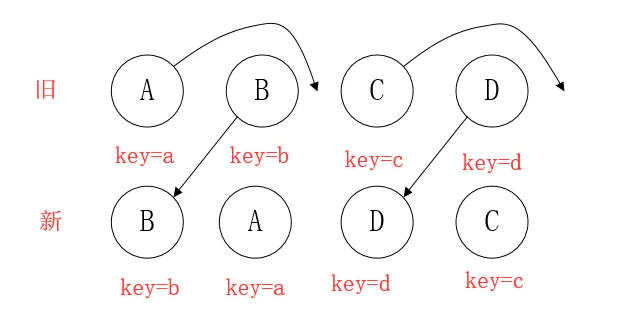

# React

- [React](#react)
  - [1. react 的 diff 算法，key 的作用](#1-react-的-diff-算法key-的作用)
  - [2. MVVM原理（实现简易MVVM）](#2-mvvm原理实现简易mvvm)
  - [3. 虚拟 dom 的好处](#3-虚拟-dom-的好处)
  - [4. 比较 vue 和 react ， React 代码与 Vue 代码互转和复用](#4-比较-vue-和-react--react-代码与-vue-代码互转和复用)
  - [5. mobx，redux 的优缺点](#5-mobxredux-的优缺点)
  - [6. react 中 render props 适用场景（类组件和函数组件的区别, render props 和 HOC 优缺点）](#6-react-中-render-props-适用场景类组件和函数组件的区别-render-props-和-hoc-优缺点)
  - [7. hooks: useState, useEffect, useCallback，useMemo](#7-hooks-usestate-useeffect-usecallbackusememo)
  - [8. react setState 什么时候同步什么时候异步](#8-react-setstate-什么时候同步什么时候异步)
  - [9. 请实现 DOM2JSON 一个函数，可以把一个 DOM 节点输出 JSON 的格式，例如下面的例子](#9-请实现-dom2json-一个函数可以把一个-dom-节点输出-json-的格式例如下面的例子)
  - [10. react 生命周期](#10-react-生命周期)
  - [11. react-router](#11-react-router)
  - [12. 组件通信](#12-组件通信)
  - [面试题](#面试题)
    - [1. react 原理](#1-react-原理)
    - [2. 手写双向绑定实现，两种](#2-手写双向绑定实现两种)
    - [3. react 常用的优化项](#3-react-常用的优化项)
    - [4. react 16/17 的新特性](#4-react-1617-的新特性)
    - [5. 两个同级的 react 组件如何通信](#5-两个同级的-react-组件如何通信)
    - [6. constructor 和 componentdidMount 的区别 为什么请求不能放在 constructor 里面](#6-constructor-和-componentdidmount-的区别-为什么请求不能放在-constructor-里面)
    - [7. React hook底层优化原理，为什么会有hooks，react hooks里的useCallback了解吗](#7-react-hook底层优化原理为什么会有hooksreact-hooks里的usecallback了解吗)
    - [8. react fiber](#8-react-fiber)
    - [8. RN 和 flutter的区别](#8-rn-和-flutter的区别)
    - [9. react的context原理](#9-react的context原理)
    - [10. redux的架构，dispach的是什么概念，redux-thunk](#10-redux的架构dispach的是什么概念redux-thunk)
    - [11. redux和mobx](#11-redux和mobx)
    - [12. immutable](#12-immutable)
    - [13. Redux中间件原理](#13-redux中间件原理)

## 1. react 的 diff 算法，key 的作用

https://www.jianshu.com/p/3ba0822018cf  

React用 三大策略 将O(n^3)复杂度 转化为 O(n)复杂度  

策略一（tree diff）：  
Web UI中DOM节点跨层级的移动操作特别少，可以忽略不计。  

策略二（component diff）：  
拥有相同类的两个组件 生成相似的树形结构，  
拥有不同类的两个组件 生成不同的树形结构。  

策略三（element diff）：  
对于同一层级的一组子节点，通过唯一id区分。  

> **tree diff**  

1. React通过updateDepth对Virtual DOM树进行层级控制。  
2. 对树分层比较，两棵树 只对同一层次节点 进行比较。如果该节点不存在时，则该节点及其子节点会被完全删除，不会再进一步比较。  
3. 只需遍历一次，就能完成整棵DOM树的比较。  

如果DOM节点出现了跨层级操作,diff会咋办呢？  
答：diff只简单考虑同层级的节点位置变换，如果是跨层级的话，只有创建节点和删除节点的操作。  

官方建议不要进行DOM节点跨层级操作，可以通过CSS隐藏、显示节点，而不是真正地移除、添加DOM节点。  

> **component diff**

1. 同一类型的两个组件，按原策略（层级比较）继续比较Virtual DOM树即可。
2. 同一类型的两个组件，组件A变化为组件B时，可能Virtual DOM没有任何变化，如果知道这点（变换的过程中，Virtual DOM没有改变），可节省大量计算时间，所以 用户 可以通过 shouldComponentUpdate() 来判断是否需要 判断计算。
3. 不同类型的组件，将一个（将被改变的）组件判断为dirty component（脏组件），从而替换 整个组件的所有节点。

注意：如果组件D和组件G的结构相似，但是 React判断是 不同类型的组件，则不会比较其结构，而是删除 组件D及其子节点，创建组件G及其子节点。  

> **element diff**  

当节点处于同一层级时，diff提供三种节点操作：删除、插入、移动。  

**插入**：组件 C 不在集合（A,B）中，需要插入  

**删除**：（1）组件 D 在集合（A,B,D）中，但 D的节点已经更改，不能复用和更新，所以需要删除 旧的 D ，再创建新的。  
（2）组件 D 之前在 集合（A,B,D）中，但集合变成新的集合（A,B）了，D 就需要被删除。  

**移动**：组件D已经在集合（A,B,C,D）里了，且集合更新时，D没有发生更新，只是位置改变，如新集合（A,D,B,C），D在第二个，无须像传统diff，让旧集合的第二个B和新集合的第二个D 比较，并且删除第二个位置的B，再在第二个位置插入D，而是 （对同一层级的同组子节点） 添加唯一key进行区分，移动即可。  

**移动的逻辑**

> 情形一：新旧集合中存在相同节点但位置不同时，如何移动节点  

  

（1）看着上图的 B，React先从新中取得B，然后判断旧中是否存在相同节点B，当发现存在节点B后，就去判断是否移动B。
B在旧 中的index=1，它的lastIndex=0，不满足 index < lastIndex 的条件，因此 B 不做移动操作。此时，一个操作是，lastIndex=(index,lastIndex)中的较大数=1.

注意：lastIndex有点像浮标，或者说是一个map的索引，一开始默认值是0，它会与map中的元素进行比较，比较完后，会改变自己的值的（取index和lastIndex的较大数）。

（2）看着 A，A在旧的index=0，此时的lastIndex=1（因为先前与新的B比较过了），满足index<lastIndex，因此，对A进行移动操作，此时lastIndex=max(index,lastIndex)=1。

（3）看着D，同（1），不移动，由于D在旧的index=3，比较时，lastIndex=2，所以改变lastIndex=max(index,lastIndex)=3

（4）看着C，同（2），移动，C在旧的index=2，满足index<lastIndex（lastIndex=3），所以移动。

由于C已经是最后一个节点，所以diff操作结束。

> 情形二：新集合中有新加入的节点，旧集合中有删除的节点

  

（1）B不移动，不赘述，更新lastIndex=1

（2）新集合取得 E，发现旧不存在，故在lastIndex=1的位置 创建E，更新lastIndex=1

（3）新集合取得C，C不移动，更新lastIndex=2

（4）新集合取得A，A移动，同上，更新lastIndex=2

（5）新集合对比后，再对旧集合遍历。判断 新集合 没有，但 旧集合 有的元素（如D，新集合没有，旧集合有），发现 D，删除D，diff操作结束。

## 2. MVVM原理（实现简易MVVM）

React不是MVVM，没有所谓的状态管理，只有数据到视图。 react 本身只是 一个函数 ui = render (data)  

参考：https://www.jianshu.com/p/2436436c1863  

第一步——实现数据劫持  

第二步——实现发布订阅模式  


## 3. 虚拟 dom 的好处

虚拟dom: 用js模拟一颗dom树,放在浏览器内存中.当你要变更时,虚拟dom使用diff算法进行新旧虚拟dom的比较,将变更放到变更队列中,反应到实际的dom树,减少了dom操作.  

1. 跨平台: 抽象了渲染的过程，为应用带来了跨平台的能力，不再是仅仅局限于浏览器端。比如React-Native和WeeX可以运行在Android、IOS平台上。  
2. 无需手动操作 DOM： 我们不再需要手动去操作 DOM，只需要写好 View-Model 的代码逻辑，框架会根据虚拟 DOM 和 数据双向绑定，帮我们以可预期的方式更新视图，极大提高我们的开发效率；  
3. 保证性能下限： 框架的虚拟 DOM 需要适配任何上层 API 可能产生的操作，它的一些 DOM 操作的实现必须是普适的，所以它的性能并不是最优的；但是比起粗暴的 DOM 操作性能要好很多，因此框架的虚拟 DOM 至少可以保证在你不需要手动优化的情况下，依然可以提供还不错的性能，即保证性能的下限；

虚拟DOM不一定比真实的DOM操作快.  
JavaScript引擎和DOM引擎使用的是同一个主线程，任何涉及到DOM的操作都需要先把JavaScript的数据结构转换为DOM的数据结构，再将JavaScript引擎挂起执行DOM引擎，执行完成后再切换执行JavaScript引擎，这种上下文的切换是很消耗性能的，所以解决DOM操作的性能问题的关键在于减少不必要的DOM操作。  

## 4. 比较 vue 和 react ， React 代码与 Vue 代码互转和复用

## 5. mobx，redux 的优缺点

https://juejin.cn/post/6844904036013965325  
https://zhuanlan.zhihu.com/p/25585910  
https://cloud.tencent.com/developer/article/1547405  

## 6. react 中 render props 适用场景（类组件和函数组件的区别, render props 和 HOC 优缺点）

render props 其实和高阶组件HOC一样，是为了给纯函数组件加上state，响应react的生命周期。  

render props: https://zhuanlan.zhihu.com/p/31267131  

组件不自己定义render函数，而是通过一个名为render的props将外部定义的render函数传入使用。  

所有用 HOC 完成的事，render props 都能搞定。 值得一提的是 react-router 4 里唯一的一个 HOC 是withRouter, 而它是用 render props 实现的，有兴趣的可以去看一下源代码: https://github.com/ReactTraining/react-router/blob/master/packages/react-router/modules/withRouter.js。  

> HOC最大的特点就是：接受一个组件作为参数，返回一个新的组件。  

demo路径：React-Webpack/src/pages/page1  

> render Props 的核心思想是，通过一个函数将class组件的state作为props传递给纯函数组件.  

demo路径：React-Webpack/src/pages/page2  

> **类组件和函数组件的区别**  

1. 函数组件是一个纯函数，它接收一个props对象返回一个react元素；而类组件需要去继承React.Component并且创建render函数返回react元素。2. 函数组件没有生命周期和状态state，而类组件有。

## 7. hooks: useState, useEffect, useCallback，useMemo

useMemo和useCallback的使用： https://www.jianshu.com/p/b71e56ea2fda  

## 8. react setState 什么时候同步什么时候异步

https://www.jianshu.com/p/799b8a14ef96  

## 9. 请实现 DOM2JSON 一个函数，可以把一个 DOM 节点输出 JSON 的格式，例如下面的例子

```text
<div><span><a></a></span><span><a></a><a></a></span></div> 
{ tag: 'DIV', 
children: [ { 
  tag: 'SPAN', children: [ { tag: 'A', children: [] } 
  ] },
```

https://blog.csdn.net/piano9425/article/details/104553403  

## 10. react 生命周期

## 11. react-router

https://www.cnblogs.com/WindrunnerMax/p/14322330.html  

React Router是建立在history对象之上的，简而言之一个history对象知道如何去监听浏览器地址栏的变化，并解析这个URL转化为location对象，然后router使用它匹配到路由，最后正确地渲染对应的组件，常用的history有三种形式： Browser History、Hash History。


## 12. 组件通信


## 面试题

### 1. react 原理

虚拟DOM（Virtual DOM）的机制：在浏览器端用Javascript实现了一套DOM API。基于React进行开发时所有的DOM构造都是通过虚拟DOM进行，每当数据变化时，React都会重新构建整个DOM树，然后React将当前整个DOM树和上一次的DOM树进行对比，得到DOM结构的区别，然后仅仅将需要变化的部分进行实际的浏览器DOM更新。而且React能够批处理虚拟DOM的刷新，在一个事件循环（Event Loop）内的两次数据变化会被合并，例如你连续的先将节点内容从A变成B，然后又从B变成A，React会认为UI不发生任何变化，而如果通过手动控制，这种逻辑通常是极其复杂的。尽管每一次都需要构造完整的虚拟DOM树，但是因为虚拟DOM是内存数据，性能是极高的，而对实际DOM进行操作的仅仅是Diff部分，因而能达到提高性能的目的。

### 2. 手写双向绑定实现，两种

https://www.jianshu.com/p/34f4bfe0866e  

### 3. react 常用的优化项

https://www.infoq.cn/article/KVE8xtRs-uPphptq5LUz  

### 4. react 16/17 的新特性

https://zhuanlan.zhihu.com/p/57544233  

### 5. 两个同级的 react 组件如何通信

https://blog.csdn.net/Charissa2017/article/details/105746685  

传统：组件A -- 传值 --> 父组件 -- 传值 --> 组件B  

### 6. constructor 和 componentdidMount 的区别 为什么请求不能放在 constructor 里面

https://www.zhihu.com/question/409602801  

1. 从代码设计角度就不推荐，constructor里面只适合做一些状态初始化工作，就连函数绑定其实都不推荐，所以在这里做异步请求明显不符合单一原则。

2. 可能得到错误的渲染。因为当你把异步更新逻辑写到 constructor 里时，这个 component 一旦被实例化就要执行，setState 来更新 view 了。但这时此 component 不一定已经被 mount，setState 来更新 view 了。但这时此 component 不一定已经被 mount。  

3. 在concurrency mode下constructor会不会执行多次。  https://zh-hans.reactjs.org/docs/concurrent-mode-adoption.html  

### 7. React hook底层优化原理，为什么会有hooks，react hooks里的useCallback了解吗

React Hooks底层实现原理：https://zhuanlan.zhihu.com/p/51356920  
hooks的管理，需要一个一致的游标去管理一系列的数组  

useMemo, useCallback：https://www.jianshu.com/p/b71e56ea2fda  

如何模拟React的生命周期

1. constructor：函数组件不需要构造函数。你可以通过调用 useState 来初始化 state。
2. componentDidMount：通过 useEffect 传入第二个参数为[]实现。
3. componentDidUpdate：通过 useEffect 传入第二个参数为空或者为值变动的数组。
4. componentWillUnmount：主要用来清除副作用。通过 useEffect 函数 return 一个函数来模拟。
5. shouldComponentUpdate：你可以用 React.memo 包裹一个组件来对它的 props 进行浅比较。来模拟是否更新组件。
6. componentDidCatch and getDerivedStateFromError：目前还没有这些方法的 Hook 等价写法，但很快会加上。

> useEffect 只是在组件首次 render 之后即 didMount 之后调用的，以及在组件卸载之时即 unmount 之后调用，如果需要在 DOM 更新之后同步执行，可以使用 useLayoutEffect。

> useMemo

```js
const memoizedValue = useMemo(() => computeExpensiveValue(a, b), [a, b]); 
```

把“创建”函数和依赖项数组作为参数传入 useMemo，它仅会在某个依赖项改变时才重新计算 memoized 值。这种优化有助于避免在每次渲染时都进行高开销的计算。  

可以避免很多不必要的开销。  

> useCallback

```js
const memoizedCallback = useCallback(
  () => {
    doSomething(a, b);
  },
  [a, b],
);
```

把回调函数及依赖项数组作为参数传入 useCallback，它将返回该回调函数的 memoized 版本, 该回调函数仅在某个依赖项改变时才会更新。  

区别在于useMemo返回的是函数运行的结果，useCallback返回的是函数。  

useCallback(fn, deps) 相当于 useMemo(() => fn, deps)  

**使用场景**  

父组件传递一个函数给子组件的时候，由于父组件的更新会导致该函数重新生成从而传递给子组件的函数引用发生了变化，这就会导致子组件也会更新，而很多时候子组件的更新是没必要的，所以我们可以通过useCallback来缓存该函数，然后传递给子组件。  

### 8. react fiber

https://segmentfault.com/a/1190000018250127


### 8. RN 和 flutter的区别

参考：https://time.geekbang.org/column/article/104040  
https://time.geekbang.org/column/article/105703

1. React Native 使用原生控件承载界面渲染，由于框架本身不负责渲染，而是由原生代理，因此我们还需要面对大量平台相关的逻辑;通过 JavaScript 虚拟机进行原生接口的调用，带来的通信低效.
2. Flutter提供了一整套从底层渲染逻辑到上层开发语言的完整解决方案：视图渲染完全闭环在其框架内部，不依赖于底层操作系统提供的任何组件，从根本上保证了视图渲染在 Android 和 iOS 上的高度一致性；Flutter 的开发语言 Dart，借助于先进的工具链和编译器，成为了少数同时支持 JIT 和 AOT 的语言之一，开发期调试效率高，发布期运行速度快、执行性能好，在代码执行效率上可以媲美原生 App。而这与 React Native 所用的只能解释执行的 JavaScript，又拉开了性能差距。(渲染引擎依靠跨平台的 Skia 图形库来实现,开发语言选用的是同时支持 JIT（Just-in-Time，即时编译）和 AOT（Ahead-of-Time，预编译）的 Dar)

### 9. react的context原理

https://www.gitsu.cn/article68  

useContext(Ctx), 当遍历组件, 遍历到Ctx.Provider组件，Ctx.Provider内部会判断context value是否变化。

如果context value变化，Ctx.Provider内部会执行一次向下深度优先遍历子树的操作，寻找与该Provider配套的Consumer。

### 10. redux的架构，dispach的是什么概念，redux-thunk

参考：https://zhuanlan.zhihu.com/p/85403048  

createStore 类似发布订阅模式，在 redux 的设计中，一个 action 只能触发某个特定的reducer 执行。  


> redux-thunk  

如果是function类型，就调用这个function（并传入 dispatch 和 getState 及 extraArgument 为参数），而不是任由让它到达 reducer，因为 reducer 是个纯函数，Redux 规定到达 reducer 的 action 必须是一个 plain object 类型。  

```js
function createThunkMiddleware(extraArgument) {
  return ({ dispatch, getState }) => next => action => {
    if (typeof action === 'function') {
      return action(dispatch, getState, extraArgument);
    }

    return next(action);
  };
}

const thunk = createThunkMiddleware();
thunk.withExtraArgument = createThunkMiddleware;

export default thunk;
```

redux-saga通过generator函数来创建的，用于解决异步问题


### 11. redux和mobx

mobx：https://blog.csdn.net/weixin_44369568/article/details/90713881  

@observer进行render控制view，对单个state属性的粒度上控制组件的render。  

mobx 常用中小型应用，redux 更适合大型应用。  

区别：

1. Redux的编程范式是函数式的,而Mobx是面向对象的；
2. 因此数据上来说Redux理想的是immutable的，每次都返回一个新的数据，而Mobx从始至终都是一份引用。因此Redux是支持数据回溯的；
3. 然而和Redux相比，使用Mobx的组件可以做到精确更新，这一点得益于Mobx的observable；对应的，Redux是用dispath进行广播，通过Provider和connect来比对前后差别控制更新粒度；Mobx更加精细一点。

Mobx的核心原理是通过action触发state的变化，进而触发state的衍生对象（computed value & Reactions）。  

Mobx是通过代理变量的getter和setter来实现的变量更新功能。  

### 12. immutable

参考：https://zhuanlan.zhihu.com/p/44571842  

对于一个持久化数据结构，每次修改后我们都会得到一个新的版本，且旧版本可以完好保留。  

为了降低重复创建对象、拷贝数据所带来的内存以及 CPU 开销，Immutable 采用了结构共享等措施以提升数据操作效率。  

Immutable.js 将所有的数据处理为一个树结构，每一次修改操作仅造成对应节点以及其父节点的新建，不受影响的节点仍然保持原先的引用，从而节约了大量内存，减少了数据拷贝的操作。  

位分区的方式，通过位运算得到当前数组的 index 选择相应分支。

### 13. Redux中间件原理

https://www.jianshu.com/p/a4ab789790b2  

```js
//一个啥都不干的中间件：
const doNothingMidddleware = (dispatch, getState) => next => action => next(action)
```

Midddleware 返回的函数接受一个 next 类型的参数，这个 next 是一个函数，如果调用了它，就代表着这个中间件完成了自己的职能，并将对 action 控制权交予下一个中间件。

redux-thunk 中间件的功能很简单。首先检查参数 action 的类型，如果是函数的话，就执行这个 action 函数，并把 dispatch, getState, extraArgument 作为参数传递进去，否则就调用 next 让下一个中间件继续处理 action 。

```js
function createThunkMiddleware(extraArgument) {
  return ({ dispatch, getState }) => next => action => {
    if (typeof action === 'function') {
      return action(dispatch, getState, extraArgument);
    }
    return next(action);
  };
}
const thunk = createThunkMiddleware();
thunk.withExtraArgument = createThunkMiddleware;
export default thunk;
```


