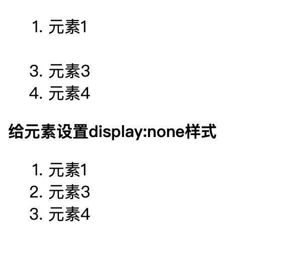
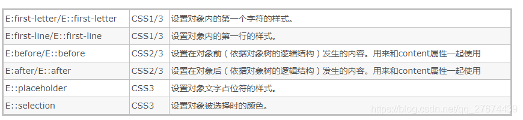
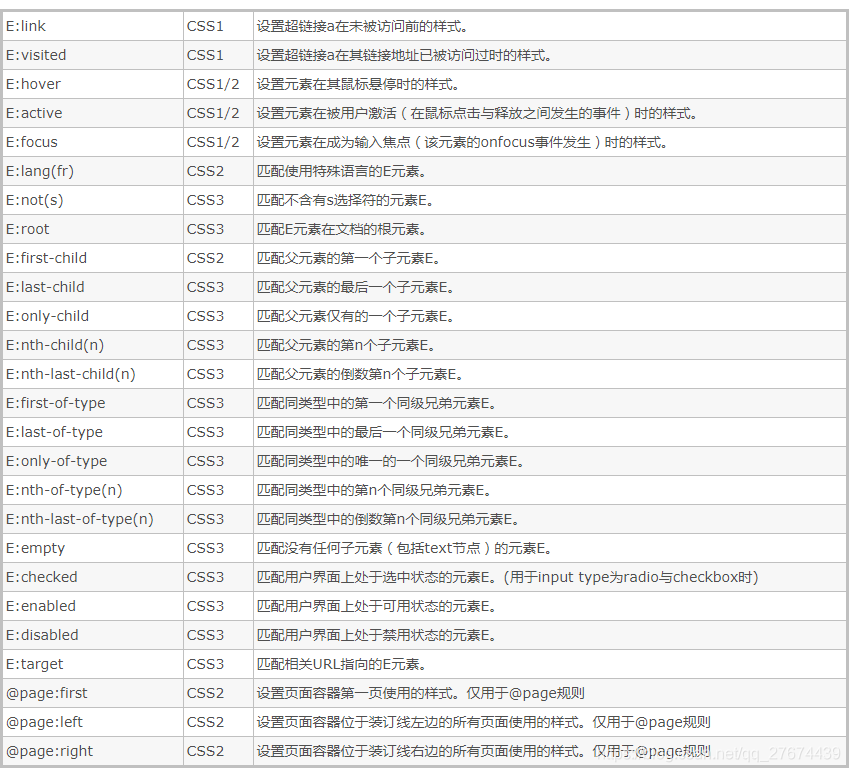

# 前端面试题

- [前端面试题](#前端面试题)
  - [1. HTML&CSS](#1-htmlcss)
    - [1. 怎么让一个不定宽高的 DIV，垂直水平居中](#1-怎么让一个不定宽高的-div垂直水平居中)
    - [2. position 几个属性的作用](#2-position-几个属性的作用)
    - [3. Css单位px，rem，em，vw，vh的区别](#3-css单位pxrememvwvh的区别)
    - [4. 什么是 BFC](#4-什么是-bfc)
    - [5. CSS引入的方式有哪些? link和@import的区别是?](#5-css引入的方式有哪些-link和import的区别是)
    - [6. 清除浮动的几种方式](#6-清除浮动的几种方式)
    - [7. display： none；与 visibility： hidden 的区别是什么](#7-display-none与-visibility-hidden-的区别是什么)
    - [8. console常用方法](#8-console常用方法)
    - [9. img标签是行内(inline)元素，为什么能够设置宽和高？](#9-img标签是行内inline元素为什么能够设置宽和高)
    - [10. 伪类和伪元素，:和::的区别](#10-伪类和伪元素和的区别)
    - [11. HTML5 中的本地存储概念是什么？生命周期有多长？](#11-html5-中的本地存储概念是什么生命周期有多长)
  - [2. JS](#2-js)
    - [1. JavaScript的基本数据类型](#1-javascript的基本数据类型)
    - [2. 原型，原型链](#2-原型原型链)
    - [3. call，apply，bind的模拟实现](#3-callapplybind的模拟实现)
    - [4. 事件循环，宏任务，微任务的执行顺序](#4-事件循环宏任务微任务的执行顺序)
    - [5. 闭包](#5-闭包)
    - [6. 函数柯里化](#6-函数柯里化)
    - [7. 惰性函数](#7-惰性函数)
    - [8. 尾递归优化](#8-尾递归优化)
    - [9. common.js 和 es6 中模块引入的区别](#9-commonjs-和-es6-中模块引入的区别)
    - [10. new 操作符具体干了什么](#10-new-操作符具体干了什么)
    - [15. promise](#15-promise)
    - [16. 深拷贝，浅拷贝](#16-深拷贝浅拷贝)
    - [17. jsonp 的原理，有什么优缺点](#17-jsonp-的原理有什么优缺点)
    - [18. 跨域的几种解决方式](#18-跨域的几种解决方式)
    - [19. 什么是事件代理](#19-什么是事件代理)
    - [20. js 延迟加载的方式有哪些](#20-js-延迟加载的方式有哪些)
  - [3. 浏览器相关](#3-浏览器相关)
    - [1. 一个 tcp 连接能发几个 http 请求](#1-一个-tcp-连接能发几个-http-请求)
    - [2. cookie token 和 session 的区别](#2-cookie-token-和-session-的区别)
    - [3. 首屏和白屏时间如何计算](#3-首屏和白屏时间如何计算)
    - [4. 了解v8引擎吗，一段js代码如何执行的](#4-了解v8引擎吗一段js代码如何执行的)
  - [4. 网络协议](#4-网络协议)
  - [5. 框架相关：React](#5-框架相关react)
    - [1. Virtual Dom 的优势在哪里？](#1-virtual-dom-的优势在哪里)
    - [2. React 的生命周期](#2-react-的生命周期)
  - [6. webpack](#6-webpack)
    - [1. loader和plugin的区别](#1-loader和plugin的区别)
    - [2. webpack打包优化配置](#2-webpack打包优化配置)
  - [7. 算法](#7-算法)
    - [1. 数组去重](#1-数组去重)

## 1. HTML&CSS

### 1. 怎么让一个不定宽高的 DIV，垂直水平居中

```html
<div class="g-container">
    <div class="g-box"></div>
</div>
```

1. flex 布局下的 margin: auto, display: flex 替换成 display: inline-flex | grid | inline-grid 也是可以的。

```css
.g-container {
    display: flex;
}

.g-box {
    margin: auto;
}
```

2. grid 布局下的 place-items: center;

```css
.g-container {
    display: grid;
    place-items: center
}

```

3. display：table-cell;

```css
.g-container {
  display: table-cell;
  text-align: center;
  vertical-align: middle;
}

.g-box {
  display: inline-block;
  vertical-align: middle;
}
```

4. CSS3 transform;

```css
.g-container {
  position: relative;
}

.g-box {
  position: absolute;
  top: 50%;
  left: 50%;
  transform: translate(-50%, -50%);
}
```

flex布局见：[阮一峰老师的Flex 布局教程](https://www.ruanyifeng.com/blog/2015/07/flex-grammar.html)  
grid布局见：[阮一峰老师的Grid 网格布局教程](https://www.ruanyifeng.com/blog/2019/03/grid-layout-tutorial.html)  

### 2. position 几个属性的作用

static | relative | absolute | sticky | fixed, 见：https://developer.mozilla.org/zh-CN/docs/Web/CSS/position  

1. static：默认位置，设置为 static 的元素，它始终会处于页面流给予的位置（static 元素会忽略任何 top、bottom、left 或 right 声明）。一般不常用。
2. relative：位置被设置为 relative 的元素，可将其移至相对于其正常位置的地方，意思就是如果设置了 relative 值，那么，它偏移的 top，right，bottom，left 的值都以它原来的位置为基准偏移，而不管其他元素会怎么样。注意 relative 移动后的元素在原来的位置仍占据空间。
3. absolute：位置设置为 absolute 的元素，可定位于相对于包含它的元素的指定坐标。意思就是如果它的父容器设置了 position 属性，并且position 的属性值为 absolute 或者 relative，那么就会依据父容器进行偏移。如果其父容器没有设置 position 属性，那么偏移是以 body 为依据。注意设置 absolute 属性的元素在标准流中不占位置。
4. fixed：位置被设置为 fixed 的元素，可定位于相对于浏览器窗口的指定坐标。不论窗口滚动与否，元素都会留在那个位置。它始终是以 body 为依据的。 注意设置 fixed 属性的元素在标准流中不占位置。
5. sticky: 被称为粘性定位元素，是计算后位置属性为 sticky 的元素。在滑动过程中，某个元素距离其父元素的距离达到sticky粘性定位的要求时(比如top：100px)；position:sticky这时的效果相当于fixed定位，固定到适当位置。可以说是相对定位relative和固定定位fixed的结合。  
元素固定的相对偏移是相对于离它最近的具有滚动框的祖先元素，如果祖先元素都不可以滚动，那么是相对于viewport来计算元素的偏移量。  

特性（坑）：

1. sticky不会触发BFC
2. z-index无效
3. 当父元素的height：100%时，页面滑动到一定高度之后sticky属性会失效。
4. 父元素不能有overflow:hidden或者overflow:auto属性。
5. 父元素高度不能低于sticky高度，必须指定top、bottom、left、right4个值之一。  

demo路径：question/HTML&CSS/q2.html  

```css
.sticky-nav {
      position: sticky;
      top: 0;
      width: 100%;
      height: 80px;
      background-color: green;
    }
```

### 3. Css单位px，rem，em，vw，vh的区别

1. px就是pixel像素的缩写，相对长度单位，网页设计常用的基本单位。像素px是相对于显示器屏幕分辨率而言的,如果 px 要换算成物理长度，需要指定精度 DPI。(显示器是由一个个像素点(pixel)所组成的，一般所说的显示器分辨率是1280x720就表示这个显示器水平方向有1280个像素，垂直方向上有720个像素。但是并非分辨率越高屏幕显示效果越好，还需要根据屏幕的大小来决定。也就是要看像素的密度(pixel density)，这个指标就是DPI).
2. em是相对长度单位。相对于当前对象内文本的字体尺寸（参考物是父元素的font-size）,如当前父元素的字体尺寸未设置，则相对于浏览器的默认字体尺寸
3. rem是CSS3新增的一个相对单位，rem是相对于HTML根元素的字体大小（font-size）来计算的长度单位,如果你没有设置html的字体大小，就会以浏览器默认字体大小，一般是16px.
4. vw是相对视口（viewport）的宽度而定的，长度等于视口宽度的1/100,假如浏览器的宽度为200px，那么1vw就等于2px（200px/100).
5. vh是相对视口（viewport）的高度而定的，长度等于视口高度的1/100,假如浏览器的高度为500px，那么1vh就等于5px（500px/100）
6. vmin和vmax是相对于视口的高度和宽度两者之间的最小值或最大值,如果浏览器的高为300px、宽为500px，那么1vmin就是3px，1vmax就是5px；如果浏览器的高为800px，宽为1080px，那么1vmin也是8px，1vmax也是10.8px.

```css
.rembox {
      font-size: 30px;
    }
    .rem {
      font-size: 0.5rem; /*16px x 0.5 = 8px*/
    }
    .embox {
      font-size: 30px;
    }
    .em {
      font-size: 0.5em; /*30px x 0.5 = 15px*/
    }
```

### 4. 什么是 BFC

BFC 即 Block Formatting Contexts (块级格式化上下文)，具有 BFC 特性的元素可以看作是隔离了的独立容器，容器里面的元素不会在布局上影响到外面的元素，并且 BFC 具有普通容器所没有的一些特性。  

只要元素满足下面任一条件即可触发 BFC 特性：

1. body 根元素
2. 浮动元素：float 除 none 以外的值
3. 绝对定位元素：position (absolute、fixed)
4. display 为 inline-block、table-cells、flex
5. overflow 除了 visible 以外的值 (hidden、auto、scroll)

布局规则：

1. 内部的 Box 会在垂直方向，一个接一个地放置。
2. Box 垂直方向的距离由 margin 决定。属于同一个 BFC 的两个相邻 Box 的 margin 会发生重
叠。
3. 每个元素的 margin box 的左边， 与包含块 border box 的左边相接触(对于从左往右的格式
化，否则相反)。即使存在浮动也是如此。
4. BFC 的区域不会与 float box 重叠。
5. BFC 就是页面上的一个隔离的独立容器，容器里面的子元素不会影响到外面的元素。反之也
如此。
6. 计算 BFC 的高度时，浮动元素也参与计算。

BFC 特性及应用：

1. 同一个 BFC 下外边距会发生折叠

```html
<style>
    div {
      width: 100px;
      height: 100px;
      background: lightblue;
      margin: 100px;
    }
  </style>
  <body>
    <div></div>
    <div></div>
  </body>
```

两个盒子之间距离只有 100px，而不是 200px。

2. BFC 可以包含浮动的元素（清除浮动）

```html
<div style="border: 1px solid #000;overflow: hidden">
    <div style="width: 100px;height: 100px;background: #eee;float: left;"></div>
</div>
```


由于容器内元素浮动，脱离了文档流，所以容器只剩下 2px 的边距高度。如果使触发容器的 BFC，那么容器将会包裹着浮动元素。

```html
<div style="border: 1px solid #000;overflow: hidden">
    <div style="width: 100px;height: 100px;background: #eee;float: left;"></div>
</div>
```


3. BFC 可以阻止元素被浮动元素覆盖

文字环绕效果：

```html
<div style="height: 100px;width: 100px;float: left;background: lightblue">我是一个左浮动的元素</div>
<div style="width: 200px; height: 200px;background: #eee">我是一个没有设置浮动, 
也没有触发 BFC 元素, width: 200px; height:200px; background: #eee;</div>
```


第二个元素有部分被浮动元素所覆盖，(但是文本信息不会被浮动元素所覆盖) 如果想避免元素被覆盖，可触第二个元素的 BFC 特性，在第二个元素中加入 overflow: hidden.


### 5. CSS引入的方式有哪些? link和@import的区别是?

有 4 种方式可以在 HTML 中引入 CSS。

1. 内联方式指的是直接在 HTML 标签中的 style 属性中添加 CSS。
2. 嵌入方式指的是在 HTML 头部中的 <style> 标签下书写 CSS 代码。
3. 链接方式指的是使用 HTML 头部的 <head> 标签link引入外部的 CSS 文件。
4. 导入方式指的是使用 CSS 规则@import引入外部 CSS 文件。

link和@import都是外部引用CSS的方式，但是存在一定的区别：  

1. link是XHTML标签，除了加载CSS外，还可以定义RSS等其他事务；@import属于CSS范畴，只能加载CSS。  
2. link引用CSS时，在页面载入时同时加载；@import需要页面网页完全载入以后加载。  
3. link是XHTML标签，无兼容问题；@import是在CSS2.1提出的，低版本的浏览器不支持。  
4. ink支持使用Javascript控制DOM去改变样式；而@import不支持。  

### 6. 清除浮动的几种方式

1. 额外标签法（在最后一个浮动标签后，新加一个标签，给其设置clear：both；）（不推荐）

2. 父级添加overflow属性（父元素添加overflow:hidden）（不推荐）

3. 使用after伪元素清除浮动（推荐使用）

```css
.clearfix:after {
  /*伪元素是行内元素 正常浏览器清除浮动方法*/
  content: "";
  display: block;
  height: 0;
  clear: both;
  visibility: hidden;
}
.clearfix {
  *zoom: 1; /*ie6清除浮动的方式 *号只有IE6-IE7执行，其他浏览器不执行*/
}
```

4. 使用before和after双伪元素清除浮动

```css
.clearfix:after,.clearfix:before{
    content: "";
    display: table;
}
.clearfix:after{
    clear: both;
}
.clearfix{
    *zoom: 1;
}
```

### 7. display： none；与 visibility： hidden 的区别是什么

display: none隐藏后的元素不占据任何空间，而visibility: hidden隐藏后的元素空间依旧保留，实际上没那么简单，visibility是一个非常有故事性的属性

1. visibility具有继承性，给父元素设置visibility:hidden;子元素也会继承这个属性。但是如果重新给子元素设置visibility: visible,则子元素又会显示出来。这个和display: none有着质的区别.

2. visibility: hidden不会影响计数器的计数，visibility: hidden虽然让一个元素不见了，但是其计数器仍在运行。这和display: none完全不一样

```html
<body>
  <div>
    <ol>
      <li>元素1</li>
      <li style="visibility: hidden">元素2</li>
      <li>元素3</li>
      <li>元素4</li>
    </ol>
  </div>
  <div>
    <strong>给元素设置display:none样式</strong>             
    <ol>
      <li>元素1</li>
      <li style="display: none">元素2</li>
      <li>元素3</li>
      <li>元素4</li>
    </ol>
  </div>
</body>
```



### 8. console常用方法

1. console.log是最常用的输入方法，正常化输出语句，还具有print占位符整数（%d||%i），浮点数（%f），对象（%o），字符（%s）;
2. console.error输出错误化的语句
3. console.info输出一条信息化语句
4. console.warn输出警告化的语句
5. console.dir可以查看语句里的信息
6. console.group输入分组
7. console.assert判断参数是否为真（==代表值相同就行，===代表值和类型都相同）
8. console.trace;顺藤摸瓜，追踪函数踪迹
9. console.time及console.timeEnd用于显示代码的运行时间

### 9. img标签是行内(inline)元素，为什么能够设置宽和高？

 标签没有独占一行，所以是行内元素， 属于[可替换元素](https://developer.mozilla.org/zh-CN/docs/Web/CSS/Replaced_element)，具有内置的宽高属性，所以可以设置.

可替换元素:

1. 浏览器根据元素的标签和属性，来决定元素的具体显示内容
2. 例如浏览器会根据  标签的src属性的值来读取图片信息并显示出来，而如果查看(X)HTML代码，则看不到图片的实际内容；又例如根据 <input> 标签的type属性来决定是显示输入框，还是单选按钮等
3. (X)HTML中的 、<input>、<textarea>、<select>、<object> 都是替换元素。这些元素往往没有实际的内容，即是一个空元素
如：、<input type="submit" name="Submit" value="提交"/>
4. 可替换元素的性质同设置了display:inline-block的元素一致
5. 替换元素一般有内在尺寸，所以具有 width 和 height，可以设定, 例如你不指定  的 width 和 height 时，就按其内在尺寸显示，也就是图片被保存的时候的宽度和高.

### 10. 伪类和伪元素，:和::的区别

伪元素/伪对象：不存在在DOM文档中，是虚拟的元素，是创建新元素。代表某个元素的子元素，这个子元素虽然在逻辑上存在，但却并不实际存在于文档树中。



伪类：存在DOM文档中，逻辑上存在但在文档树中却无须标识的“幽灵”分类。



伪类只能使用“：”  
而伪元素既可以使用“:”，也可以使用“::”  
因为伪类是类似于添加类所以可以是多个，而伪元素在一个选择器中只能出现一次，并且只能出现在末尾  

:after/::after和:before/::before的异同  

相同点

1. 都可以用来表示伪类对象，用来设置对象前的内容
2. :before和::before写法是等效的; :after和::after写法是等效的

不同点

1. :before/:after是Css2的写法，::before/::after是Css3的写法
2. :before/:after 的兼容性要比::before/::after好

> 注意：

1. 伪元素要配合content属性一起使用
2. 伪元素不会出现在DOM中，所以不能通过js来操作，仅仅是在 CSS 渲染层加入
3. 伪元素的特效通常要使用:hover伪类样式来激活

### 11. HTML5 中的本地存储概念是什么？生命周期有多长？

1. 本地存储（localStorage && sessionStorage）  

过期时间：localStorage 永久存储，永不失效除非手动删除  
        sessionStorage 浏览器重新打开后就消失了  

大小：sessionStorage 约 5M、localStorage 约 20M

2. 离线缓存（application cache）  
Application Cache是HTML5的新特性，允许浏览器在本地存储页面所需要的资源，使得页面离线也可以访问。  

三个优势：  
1、离线浏览 - 用户可在应用离线时使用它们  
2、速度 - 已缓存资源加载得更快  
3、减少服务器负载 - 浏览器将只从服务器下载更新过或更改过的资源。  

如需启用应用程序缓存，在文档的标签中设置manifest 属性, 这个文件一般为.appcache类型，称为缓存清单(cache manifest)文件，manifest 文件可分为三个部分：

- CACHE MANIFEST - 在此标题下列出的文件将在首次下载后进行缓存
- NETWORK - 在此标题下列出的文件需要与服务器的连接，且不会被缓存
- FALLBACK - 在此标题下列出的文件规定当页面无法访问时的回退页面（比如 404 页面）

一个完整的缓存清单文件如下：

```text
CACHE MANIFEST
# version xx.xx.xx
CACHE:
needBeCached.png
needBeCached2.js

NETWORK:
notNeedBeCached.html
notNeedBeCached2.css

FALLBACK:
/ 404.html
```

3. indexedDB

IndexedDB 就是浏览器提供的本地数据库，它可以被网页脚本创建和操作。IndexedDB 允许储存大量数据，提供查找接口，还能建立索引。这些都是 LocalStorage 所不具备的。就数据库类型而言，IndexedDB 不属于关系型数据库（不支持 SQL 查询语句），更接近 NoSQL 数据库。  

IndexedDB 具有以下特点：  
（1）键值对储存。 IndexedDB 内部采用对象仓库（object store）存放数据。所有类型的数据都可以直接存入，包括 JavaScript 对象。对象仓库中，数据以"键值对"的形式保存，每一个数据记录都有对应的主键，主键是独一无二的，不能有重复，否则会抛出一个错误。  
（2）异步。 IndexedDB 操作时不会锁死浏览器，用户依然可以进行其他操作，这与 LocalStorage 形成对比，后者的操作是同步的。异步设计是为了防止大量数据的读写，拖慢网页的表现。  
（3）支持事务。 IndexedDB 支持事务（transaction），这意味着一系列操作步骤之中，只要有一步失败，整个事务就都取消，数据库回滚到事务发生之前的状态，不存在只改写一部分数据的情况。  
（4）同源限制 IndexedDB 受到同源限制，每一个数据库对应创建它的域名。网页只能访问自身域名下的数据库，而不能访问跨域的数据库。  
（5）储存空间大 IndexedDB 的储存空间比 LocalStorage 大得多，一般来说不少于 250MB，甚至没有上限。  
（6）支持二进制储存。 IndexedDB 不仅可以储存字符串，还可以储存二进制数据（ArrayBuffer 对象和 Blob 对象）。  

4. WebSQL

WebSQL 并不是 HTML5规范的一部分，而是一个独立的规范，它可以用来做一些离线应用  

核心API  
openDatabase() => 用来打开或创建数据库（没有时则创建，有则打开）  
transaction()　　=> 这个方法可以控制一个或多个事务，以及基于这种情况提交或者回滚  
executeSql()       =>用于执行实际的 SQl 查询  

这个功能可以在最新版的 chrome, Safari 和 Opera  

## 2. JS

### 1. JavaScript的基本数据类型

8种： Number、String、Boolean、undefined、object、Null、Symbol、bigInt  

### 2. 原型，原型链

### 3. call，apply，bind的模拟实现

### 4. 事件循环，宏任务，微任务的执行顺序

### 5. 闭包

### 6. 函数柯里化

### 7. 惰性函数

### 8. 尾递归优化

### 9. common.js 和 es6 中模块引入的区别

CommonJS 是一种模块规范，最初被应用于 Nodejs，成为 Nodejs 的模块规范。运行在浏览器端的 JavaScript 由于也缺少类似的规范，在 ES6 出来之前，前端也实现了一套相同的模块规范 (例如: AMD)，用来对前端模块进行管理。自 ES6 起，引入了一套新的 ES6 Module 规范，在语言标准的层面上实现了模块功能，而且实现得相当简单，有望成为浏览器和服务器通用的模块解决方案。但目前浏览器对 ES6 Module 兼容还不太好，我们平时在 Webpack 中使用的 export 和 import，会经过 Babel 转换为 CommonJS 规范。在使用上的差别主要有：

CommonJS 模块输出的是一个值的拷贝，ES6 模块输出的是值的引用。
CommonJS 模块是运行时加载，ES6 模块是编译时输出接口。
CommonJs 是单个值导出，ES6 Module可以导出多个
CommonJs 是动态语法可以写在判断里，ES6 Module 静态语法只能写在顶层
CommonJs 的 this 是当前模块，ES6 Module的 this 是 undefined

### 10. new 操作符具体干了什么

1. 创建一个新对象；
2. 将构造函数的作用域赋给新对象（因此this就指向了这个新对象）；
3. 执行构造函数中的代码（为这个新对象添加属性）；
4. 返回新对象；


### 15. promise

### 16. 深拷贝，浅拷贝


### 17. jsonp 的原理，有什么优缺点

### 18. 跨域的几种解决方式

### 19. 什么是事件代理

### 20. js 延迟加载的方式有哪些


## 3. 浏览器相关

### 1. 一个 tcp 连接能发几个 http 请求

如果是 HTTP 1.0 版本协议，一般情况下，不支持长连接，因此在每次请求发送完毕之后，TCP 连接即会断开，因此一个 TCP 发送一个 HTTP 请求，但是有一种情况可以将一条 TCP 连接保持在活跃状态，那就是通过 Connection 和 Keep-Alive 首部，在请求头带上 Connection: Keep-Alive，并且可以通过 Keep-Alive 通用首部中指定的，用逗号分隔的选项调节 keep-alive 的行为，如果客户端和服务端都支持，那么其实也可以发送多条，不过此方式也有限制，可以关注《HTTP 权威指南》4.5.5 节对于 Keep-Alive 连接的限制和规则。  

而如果是 HTTP 1.1 版本协议，支持了长连接，因此只要 TCP 连接不断开，便可以一直发送 HTTP 请求，持续不断，没有上限；
同样，如果是 HTTP 2.0 版本协议，支持多用复用，一个 TCP 连接是可以并发多个 HTTP 请求的，同样也是支持长连接，因此只要不断开 TCP 的连接，HTTP 请求数也是可以没有上限地持续发送.  

### 2. cookie token 和 session 的区别


### 3. 首屏和白屏时间如何计算


### 4. 了解v8引擎吗，一段js代码如何执行的

在执行一段代码时，JS 引擎会首先创建一个执行栈.  

然后JS引擎会创建一个全局执行上下文，并push到执行栈中, 这个过程JS引擎会为这段代码中所有变量分配内存并赋一个初始值（undefined），在创建完成后，JS引擎会进入执行阶段，这个过程JS引擎会逐行的执行代码，即为之前分配好内存的变量逐个赋值(真实值)。  

如果这段代码中存在function的声明和调用，那么JS引擎会创建一个函数执行上下文，并push到执行栈中，其创建和执行过程跟全局执行上下文一样。但有特殊情况，即当函数中存在对其它函数的调用时，JS引擎会在父函数执行的过程中，将子函数的全局执行上下文push到执行栈，这也是为什么子函数能够访问到父函数内所声明的变量。  

还有一种特殊情况是，在子函数执行的过程中，父函数已经return了，这种情况下，JS引擎会将父函数的上下文从执行栈中移除，与此同时，JS引擎会为还在执行的子函数上下文创建一个闭包，这个闭包里保存了父函数内声明的变量及其赋值，子函数仍然能够在其上下文中访问并使用这边变量/常量。当子函数执行完毕，JS引擎才会将子函数的上下文及闭包一并从执行栈中移除。  

最后，JS引擎是单线程的，那么它是如何处理高并发的呢？即当代码中存在异步调用时JS是如何执行的。比如setTimeout或fetch请求都是non-blocking的，当异步调用代码触发时，JS引擎会将需要异步执行的代码移出调用栈，直到等待到返回结果，JS引擎会立即将与之对应的回调函数push进任务队列中等待被调用，当调用(执行)栈中已经没有需要被执行的代码时，JS引擎会立刻将任务队列中的回调函数逐个push进调用栈并执行。这个过程我们也称之为事件循环。  

需要更深入的了解JS引擎，必须理解几个概念，执行上下文，闭包，作用域，作用域链，以及事件循环。  

## 4. 网络协议

## 5. 框架相关：React

### 1. Virtual Dom 的优势在哪里？

DOM 引擎、JS 引擎 相互独立，但又工作在同一线程（主线程）
JS 代码调用 DOM API 必须 挂起 JS 引擎、转换传入参数数据、激活 DOM 引擎，DOM 重绘后再转换可能有的返回值，最后激活 JS 引擎并继续执行若有频繁的 DOM API 调用，且浏览器厂商不做“批量处理”优化，
引擎间切换的单位代价将迅速积累若其中有强制重绘的 DOM API 调用，重新计算布局、重新绘制图像会引起更大的性能消耗。

其次是 VDOM 和真实 DOM 的区别和优化：

1. 虚拟 DOM 不会立马进行排版与重绘操作
2. 虚拟 DOM 进行频繁修改，然后一次性比较并修改真实 DOM 中需要改的部分，最后在真实 DOM 中进行排版与重绘，减少过多DOM节点排版与重绘损耗
3. 虚拟 DOM 有效降低大面积真实 DOM 的重绘与排版，因为最终与真实 DOM 比较差异，可以只渲染局部

### 2. React 的生命周期


## 6. webpack

### 1. loader和plugin的区别

### 2. webpack打包优化配置


## 7. 算法

### 1. 数组去重


